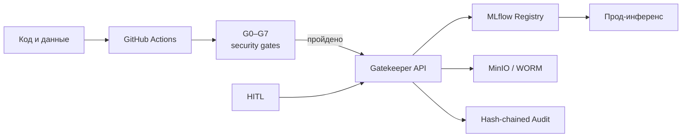

# Платформа безопасного MLOps (MLSecOps)

> Сквозная платформа безопасной доставки ML-моделей: гейты G0–G7 в CI/CD, неизменяемые артефакты, hash-chained аудит и ручное подтверждение критичных релизов. Проект программы Альфа-Банк × «Сириус», 2026.


## Что реализовано

- реестр моделей и датасетов поверх MLflow с единым Gatekeeper API;
- security gates G0–G7: секреты, зависимости, код, данные, модель, образ и подпись;
- WORM-хранение продакшен-артефактов и контролируемая blue-green замена;
- аудит событий с hash-chain и привязкой к серверной идентичности пользователя;
- HITL-проверка для критичных моделей и внешних весов;
- демонстрационные сценарии безопасного и вредоносного обучения.



Платформа управления безопасностью ML поверх MLOps: реестр моделей и датасетов,
единая неподделываемая история событий, Security Gates (G0–G7) в CI/CD,
ручной контроль (HITL) для критичных моделей и runtime-защита прод-инференса.

> **Девиз:** там, где MLOps делает систему надёжной, MLSecOps делает её неуязвимой.
> Безопасность — встроенная фича системы, а не патчи поверх инцидентов.

---

## С чего начать

Вся документация — в каталоге [`docs/`](docs/). Точка входа и карта чтения:
**[docs/00_INDEX.md](docs/00_INDEX.md)**.

Если вы агент-исполнитель и пришли что-то реализовывать — читайте сначала
**[docs/00_INDEX.md](docs/00_INDEX.md)**, затем
**[docs/IMPLEMENTATION_PLAN.md](docs/IMPLEMENTATION_PLAN.md)**.

## Канон проекта (одной страницей)

Эти решения зафиксированы и не обсуждаются заново при реализации. Полностью — в
[docs/05_CANONICAL_FLOW.md](docs/05_CANONICAL_FLOW.md).

1. **Прод-артефакт всегда обучается в CI из кода.** Локальное обучение — только
   эксперимент. Если CI-обучение невозможно (внешние веса HF/Kaggle) — артефакт
   замораживается как есть, прогоняется через все применимые гейты и **обязательно**
   требует ручной проверки MLSecOps (HITL).
2. **Идентичность неподделываема.** Единый аккаунт (SSO) для UI/бэкенда и MLflow.
   MLflow стоит за auth-прокси и наружу не торчит; личность пользователя проставляется
   **серверно**, клиент её задать не может. У каждого свой аккаунт, своя роль.
3. **CI = GitHub Actions через self-hosted runner**, поднятый в `docker compose`
   (джобы исполняются на машине демо; красивый UI с джобами).
4. **Прод неизменяем.** Прод-модель и её датасет заморожены (WORM). Доработка — только
   на копии, с полным прохождением проверок и контролируемой blue-green заменой.
5. **Каждый гейт — свой Docker-образ** (изоляция, least privilege, свои инструменты).
6. **Любое действие пишется в неподделываемый Audit Trail** (`events`, hash-chain).

## Технологический стек (кратко)

Python 3.11 · FastAPI (бэкенд/Gatekeeper + инференс) · Streamlit (UI) · PostgreSQL ·
MinIO (S3) · Redis · MLflow (tracking + registry) · GitHub Actions + self-hosted runner ·
Docker / docker compose · gitleaks · pip-audit · bandit · trivy · modelscan/picklescan ·
cosign/sigstore · evidently. Подробно и с обоснованием — [docs/15_TECH_STACK.md](docs/15_TECH_STACK.md).

## Запуск (целевой)

```bash
cp .env.example .env
docker compose -f infra/docker-compose.yml up --build
# UI:        http://localhost:8501
# Gatekeeper http://localhost:8000
# MLflow:    http://localhost:5000 (через auth-прокси)
# MinIO:     http://localhost:9001
```

Демо-сценарии — [docs/16_DEMO_SCENARIOS.md](docs/16_DEMO_SCENARIOS.md).

Локальные базы, журналы событий, PID-файлы и диагностические выгрузки не хранятся в Git и создаются при запуске.

## Лицензия

MIT — см. [`LICENSE`](LICENSE).
