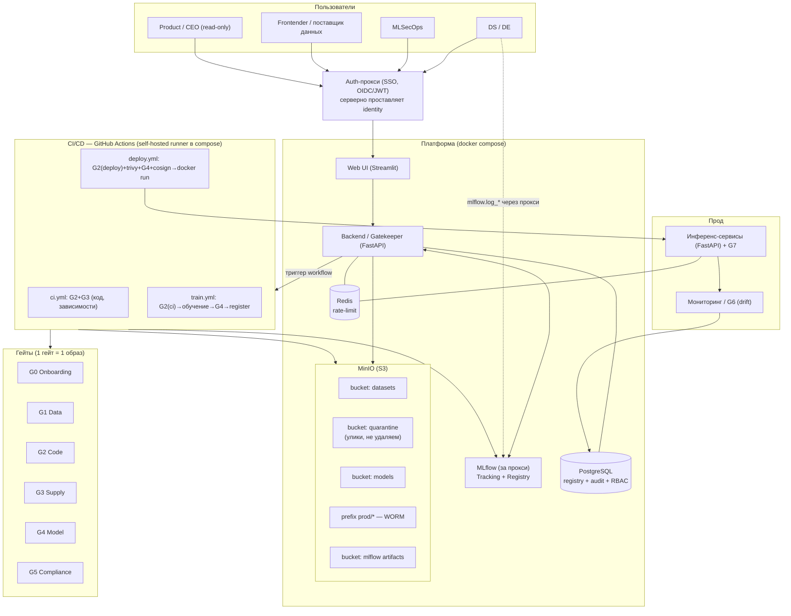

# 04 — Архитектура

## 4.1 Обзор

Платформа — слой управления и безопасности над MLOps. Все компоненты поднимаются одним
`docker compose`. Поток релиза управляется MLflow (теги/алиасы) и проходит через гейты в CI.

## 4.2 Компоненты

| Компонент | Технология | Назначение |
|---|---|---|
| **Web / UI** | Streamlit | Личный кабинет: загрузка данных, паспорт модели, форма верификации, Approve, реестр, история, находки, дашборд. |
| **Backend / Gatekeeper** | FastAPI (`core/` + `src/api/`) | Единая точка: REST API, запуск гейтов (deep audit), согласование с реестром/историей, RBAC. |
| **Auth-прокси** | OIDC/JWT-прокси (напр. oauth2-proxy / Authelia / кастом) | Единая аутентификация для UI/бэкенда и MLflow; **серверно проставляет identity**. |
| **MLflow** | MLflow Tracking + Model Registry | Эксперименты, версии, артефакты. Стоит **за** auth-прокси, наружу не торчит. |
| **Реестр (наш)** | PostgreSQL | Статусы безопасности, Tier, HITL, lineage, паспорт, находки, аудит. |
| **Хранилище** | MinIO (S3) | Бакеты `datasets` / `quarantine` / `models` (+ `mlflow`); прод — WORM. |
| **Очередь/лимиты** | Redis | Rate-limit для G7, кэш выпадашек. |
| **CI/CD** | GitHub Actions + **self-hosted runner** в compose | Гейты, обучение, деплой. Джобы исполняются на машине демо. |
| **Гейты** | по одному Docker-образу на гейт | G0–G7, изолированный запуск, единый контракт. |
| **Инференс** | FastAPI-сервисы (по сервису на модель) | Прод-эндпоинты с runtime-защитой (G7). |
| **Мониторинг** | evidently + дашборд (Streamlit/Grafana) | Дрейф (PSI), деградация, детект подмены модели (G6). |

## 4.3 Схема (целевая)



## 4.4 Ключевые архитектурные решения

1. **MLflow за auth-прокси.** MLflow OSS не умеет неподделываемую пер-юзер аутентификацию.
   Поэтому он не торчит наружу; доступ — только через прокси, который аутентифицирует
   пользователя (SSO) и **серверно** проставляет его identity в run/теги/события. Клиент
   не может задать чужую личность. Детали — [`06_IDENTITY_AND_AUTH.md`](06_IDENTITY_AND_AUTH.md).

2. **Два входа данных, одна identity.** DS логирует данные/модели через MLflow-код
   (`mlflow.data.from_pandas`, `log_input`, `log_model`) — но ходит через прокси.
   Не-кодеры (frontender) грузят через **UI-аплоад → бэкенд**, который логирует в MLflow
   **за них**, проставляя их аутентифицированную личность (не «системный» аккаунт).
   Концептуально любой вход данных материализуется в MLflow + наш реестр.

3. **Статус — в Postgres, не в расположении файла.** MLflow не перекладывает артефакты
   между бакетами по статусу безопасности. Статусы (`unchecked/quarantine/ok/prod`) живут
   в нашей БД; в MinIO — фиксированные бакеты `datasets`/`quarantine`/`models`. Прод-артефакты
   получают WORM-неизменяемость на префиксе `prod/*`.

4. **Прод-артефакт рождается в CI.** Локально обученная модель — только эксперимент. В прод
   едет то, что собрал CI из проверенного кода и данных (см. [`05_CANONICAL_FLOW.md`](05_CANONICAL_FLOW.md)).
   Исключение — внешние веса: замораживаются и проходят HITL.

5. **Каждый гейт — свой образ.** Изоляция (least privilege, sandbox для опасных артефактов),
   независимые тулчейны и версии, параллельность. Контракт — [`07_SECURITY_GATES.md`](07_SECURITY_GATES.md).

6. **CI исполняется локально.** GitHub Actions с self-hosted runner внутри compose: семантика
   GHA сохраняется, но джобы крутятся на машине демо (надёжность показа). См. [`12_CICD.md`](12_CICD.md).

## 4.5 Структура репозитория (целевая)

```
core/                 БД, хранилище, валидация паспорта, утилиты MLflow, identity
  db.py               БД + log_event (hash-chain) + хелперы datasets/models/findings/RBAC
  storage.py          MinIO: бакеты, upload/download, WORM на prod
  model_card.py       pydantic-валидация паспорта (G0)
  mlflow_utils.py     доступ MLflow→MinIO, download_artifacts, register_model_version
  identity.py         проверка identity из прокси, RBAC-хелперы require_role
src/
  api/                FastAPI Gatekeeper (эндпоинты, /verify, триггер CI)
  gates/<gate>/       1 гейт = 1 папка: <gate>.py + Dockerfile + requirements.txt + __init__.py
  ingest_dataset/     онбординг датасета (источник→G1→бакет→реестр→события)
  run_data_checks/    пакетный прогон демо-датасетов
  serve/              FastAPI-инференс + G7 (rate-limit/валидация/DLP)
  train/              train.py (обучение в CI)
  monitor/            drift/PSI (G6), детект подмены
ui/app.py             Streamlit
infra/                docker-compose.yml, init.sql, Dockerfile.*, runner, auth-proxy конфиг
data/                 make_datasets.py + демо-датасеты
demo/insecure/        фикстуры небезопасного кода/данных (только для демонстрации гейтов)
tests/                smoke-тесты
.github/workflows/    ci.yml, train.yml, deploy.yml
docs/                 эта документация
```
