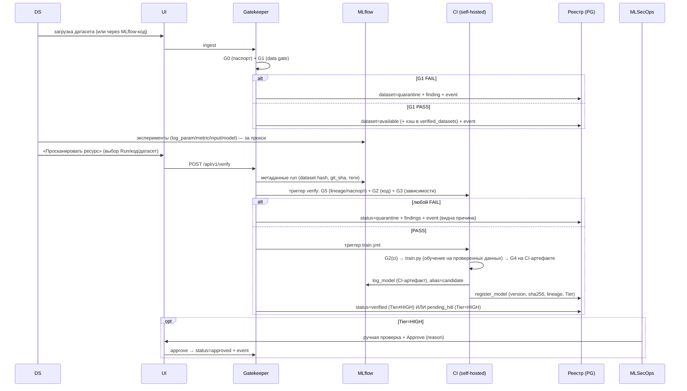
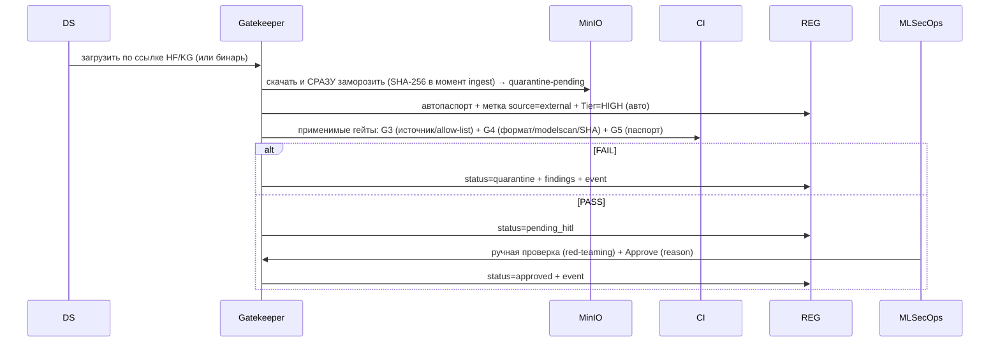

# 05 — Канонический поток (ГЛАВНЫЙ ДОКУМЕНТ)

> Это единый источник правды. Если любой другой документ противоречит этому — прав этот.

Здесь зафиксирован весь путь артефакта: от загрузки данных до прода, вывода из эксплуатации
и замены. Все решения ниже **согласованы и не пересматриваются** при реализации.

---

## 5.1 Зафиксированные решения (канон)

1. **Прод-артефакт всегда обучается в CI из кода** (CI-обучение — канон). Локальное обучение
   в Jupyter/MLflow — это **только эксперимент**, сам по себе в прод не идёт.
2. **Если CI-обучение невозможно** (готовые внешние веса с HuggingFace/Kaggle, которые мы не
   дообучаем) — артефакт **замораживается как есть**, проходит все применимые гейты, получает
   автогенерируемый паспорт с меткой «внешний источник» и **обязательно** требует ручной
   валидации MLSecOps (HITL).
3. **Идентичность неподделываема.** Единый аккаунт (SSO) на UI/бэкенд и MLflow. MLflow за
   auth-прокси; личность проставляется серверно. У каждого свой аккаунт и роль.
   (Механика — [`06_IDENTITY_AND_AUTH.md`](06_IDENTITY_AND_AUTH.md).)
4. **Два входа данных, одна личность.** DS — через MLflow-код (за прокси). Не-кодеры — через
   UI-аплоад → бэкенд логирует в MLflow за них, проставляя **их** личность.
5. **Tier** назначается **только** авто-правилами или MLSecOps; смена логируется. `HIGH` → HITL.
6. **Внутренние данные проверяются полностью**, всеми применимыми проверками. **Любое изменение
   данных → перезапуск всех проверок с нуля.** (Никакого «облегчённого режима для доверенного
   источника» — у нас может быть инсайдер; см. [`17_DATASET_LIFECYCLE.md`](17_DATASET_LIFECYCLE.md).)
   Fast-path по хэшу допустим только для **бит-в-бит идентичного** ранее проверенного датасета.
7. **SHA-якоря целостности** (см. §5.7): CI-артефакт хэшируется в конце обучения; внешние веса —
   в момент ingest. Мутабельный «черновик» в прод никогда не потребляется.
8. **CI = GitHub Actions через self-hosted runner** в `docker compose`.
9. **Прод неизменяем** (WORM): прод-модель и её датасет заморожены. Доработка — только на копии,
   с полным прохождением проверок и blue-green заменой (§5.6).
10. **Каждое действие → запись в `events`** (hash-chain, неподделываемо).

---

## 5.2 Стадии (карта)

```
0. Регистрация/доступы (MLSecOps)
1. Подготовка данных (Jupyter)           — грязная зона, гейтов нет
2. Загрузка датасета                      → G0 + G1   (через UI или MLflow-код)
3. Локальные эксперименты (MLflow)        — песочница, гейтов нет
4. Верификация (Gatekeeper /verify)       → G5 + G2 + G3 (код, зависимости, lineage)
5. Обучение в CI (train.yml)              → G2(ci) → train → G4 → register (candidate)
6. Деплой (deploy.yml) + HITL для HIGH    → G2(deploy)+trivy → G4 → cosign → docker run
7. Рантайм                                → G7 (rate-limit, валидация, DLP)
8. Мониторинг                             → G6 (drift/PSI, детект подмены)
9. Замена / откат / вывод из эксплуатации → blue-green + alias + retire (MLSecOps)
```

---

## 5.3 Поток A — обычная модель (обучаем сами, КАНОН)



Ключевое: **G4 проверяет артефакт, который произвёл CI**, а не черновик из ноутбука.
Черновик DS остаётся экспериментом; прод собирается заново из git+датасета.

---

## 5.4 Поток B — внешние веса (HF/Kaggle, без обучения)

Применяется, когда CI-обучение невозможно/не нужно (готовая лицензированная модель).



Особенности внешних весов:
- **Tier = HIGH всегда** (авто-правило) → HITL обязателен.
- Нет «кода, который создал модель» → G2 на коде обучения неприменим; применяются G3/G4/G5.
- Артефакт **хэшируется в момент скачивания** и дальше не меняется (якорь целостности).
- Честный предел: трояны в весах (не pickle-RCE) сканерами не ловятся — закрываем
  меткой источника + HITL + атрибуцией. См. [`08_THREAT_MODEL.md`](08_THREAT_MODEL.md).

---

## 5.5 Деплой в прод (общий для A и B)

```mermaid
sequenceDiagram
    participant SEC as MLSecOps
    participant BE as Gatekeeper
    participant CI as deploy.yml
    participant S3 as MinIO (WORM)
    participant INF as Инференс

    SEC->>BE: DEPLOY (только approved; Tier=HIGH — после HITL)
    BE->>CI: deploy.yml
    CI->>CI: G2(deploy: secrets+SAST+CVE) + trivy(образ) + G4(SHA-сверка с реестром)
    CI->>CI: cosign sign (артефакт + образ)
    CI->>S3: положить прод-артефакт в models/prod/* (WORM)
    CI->>INF: проверка подписи + SHA ПЕРЕД docker run → запуск
    INF->>INF: health-check
    CI->>BE: alias=production, status=prod, event
```

Перед `docker run`: **обязательная проверка cosign-подписи и сверка SHA** с реестром.
Несовпадение → деплой отменён, событие в `events`.

---

## 5.6 Замена прод-модели (N5) и вывод из эксплуатации

Прод-модель и её датасет **неизменяемы**. Чтобы выпустить улучшенную версию:

1. **Копия датасета.** Прод-датасет лочится. Делаем новую версию (копию) → она проходит
   G1 **с нуля**. Правки кода → git → G2/G3.
2. **Обучение кандидата.** `train.yml` обучает новую версию на проверенной копии → G4 на
   CI-артефакте → G5 (lineage: новый dataset_version + git_sha + run_id) → cosign-подпись.
3. **HITL.** Прод-модели по умолчанию `Tier=HIGH` → Approve только у MLSecOps; DS может только
   *инициировать*, не апрувить свою.
4. **Атомарная замена (blue-green).** Поднять новый инференс-контейнер → проверить подпись+SHA
   → health-check → только потом переключить трафик. MLflow alias `production` → новой версии,
   старая → `previous`. Старый артефакт **не удаляется** (WORM, для отката).
5. **Откат.** Кнопка revert (MLSecOps): alias `production` → обратно на `previous`. Если
   health-check новой версии не прошёл — трафик не переключается, старая остаётся, алерт.
6. **Retire (вывод из эксплуатации).** MLSecOps снимает модель: alias снят, статус `retired`,
   артефакт остаётся в хранилище (история/аудит), датасет остаётся залоченным в lineage.
7. **Аудит.** Каждая операция (`prod_promote` / `prod_rollback` / `retire`) — только MLSecOps,
   с обязательным `reason`, пишется в `events` (актор = серверная identity).

---

## 5.7 Где якорится целостность (SHA-256)

| Что | Когда считается SHA | Где хранится | Где сверяется |
|---|---|---|---|
| CI-артефакт (поток A) | в конце `train.py` в CI | реестр `model_versions.sha256` + cosign | перед `docker run` |
| Внешние веса (поток B) | в момент `ingest` (заморозка) | реестр + cosign после HITL | перед `docker run` |
| Датасет | при загрузке (`mlflow.data` digest / hashlib) | `datasets` / `verified_datasets` | при повторном использовании (fast-path) |
| Черновик DS в MLflow | — | — | **не используется в проде** (CI пересобирает) |

Принцип: **прод никогда не потребляет мутабельный черновик**. Поэтому подмена файла в
«свалке» не может отравить прод — CI пересобирает модель из git+проверенного датасета, либо
внешний артефакт заморожен по хэшу сразу при скачивании.

---

## 5.8 Зависимость статусов (данные ↔ код ↔ модель)

- Модель **зависит** от данных и кода; данные/код от модели — нет.
- Если данные `FAIL` → модель, обученная на них, не может быть `OK` (наследует блок).
- Если код `FAIL` → модель `blocked`, даже если веса по отдельности «чистые».
- Если данные `OK`, а модель `FAIL` → модель `blocked`, данные остаются `OK`.
- **Ретроактивно:** если датасет позже признан небезопасным, по lineage поднимается флаг на
  все модели, обученные на нём; прод-модель на скомпрометированных данных → инцидент + кандидат
  на откат/retire (решение MLSecOps).

---

## 5.9 Резюме «что куда едет»

| Источник | Обучение | Гейты | Tier | HITL | Прод-артефакт |
|---|---|---|---|---|---|
| Свой код + свои/проверенные данные | **в CI** | G0,G1,G2,G3,G4,G5 | по правилам | если HIGH | выход CI |
| Внешние веса (HF/KG) | нет | G3,G4,G5 (+G0 паспорт) | **HIGH** | **всегда** | замороженный артефакт |
| Локальный эксперимент | локально | — | — | — | **не идёт в прод** |
