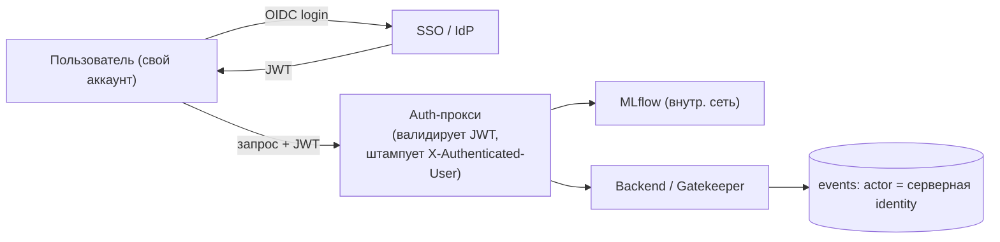

# 06 — Идентичность, аутентификация и RBAC

Этот документ закрывает требование: **«у каждого свой аккаунт, своя роль; подделка личности
невозможна; действия в MLflow и в нашем сервисе отслеживаются согласованно»**.

## 6.1 Проблема, которую решаем

MLflow OSS не имеет нормальной пер-юзер аутентификации. Если дать всем общий токен и
полагаться на `os.getenv("USER")` / клиентские теги — личность подделывается одной строкой,
а вся атрибуция («найдём злоумышленника») и ролёвка становятся декоративными.

## 6.2 Решение: единый SSO + auth-прокси, серверный штамп личности

1. **Единый провайдер идентичности (SSO).** Один аккаунт пользователя действителен и для
   UI/бэкенда, и для MLflow. Логин — через провайдера (OIDC; для демо — локальный
   Keycloak/Authelia/Dex или упрощённый JWT-issuer в бэкенде).
2. **MLflow за auth-прокси.** MLflow **не публикуется наружу**. Доступ к нему — только через
   прокси (oauth2-proxy / Authelia / кастомный reverse-proxy на FastAPI). Прокси:
   - проверяет токен/сессию пользователя;
   - **серверно** добавляет проверенную личность (`X-Authenticated-User`, неизменяемый клиентом);
   - прокидывает запрос в MLflow.
3. **Личность проставляется на сервере, не клиентом.** В каждый run/эксперимент и в каждое
   наше событие пишется личность, **извлечённая из проверенного токена**, а не из клиентского
   поля. Клиент физически не может выдать себя за другого.
4. **Короткоживущие пер-юзер креды.** DS, работающий из ноутбука через `mlflow`-SDK, получает
   от платформы короткоживущий токен (per-user), а не общий секрет. Токен привязан к его
   аккаунту; прокси валидирует и штампует личность.

## 6.3 Два входа данных — одна согласованная личность

| Кто | Как входит | Чья личность в MLflow/событиях |
|---|---|---|
| DS / DE (пишет ML-код) | `mlflow.*` из ноутбука через прокси (per-user токен) | его аккаунт (штамп прокси) |
| Frontender / не-кодер | UI-аплоад файла → бэкенд логирует в MLflow за него | **его** аккаунт (бэкенд берёт из сессии), **не** «системный» |

Так выполняется требование: даже когда бэкенд пишет в MLflow от имени пользователя, актором
остаётся **аутентифицированный человек**, и это согласованно отражается в истории.

## 6.4 RBAC (контроль доступа по ролям)

- Роли: `DS`, `DE`, `MLSecOps`, `Product`, `CEO`. Матрица прав — [`03_PERSONAS_AND_ROLES.md`](03_PERSONAS_AND_ROLES.md).
- Привилегированные действия защищены хелпером `require_role(...)` в бэкенде:
  Approve, deploy, rollback, retire, смена Tier, отметка FP, выдача доступов, `data_export`.
- Доступ к датасету — только при наличии записи в `dataset_access` (регистрация + назначение).
- Любой отказ по правам → `403` **и** событие в `events` (для атрибуции попытки).

## 6.5 Назначение Tier (анти-обход)

Tier может быть установлен **только**:
- **авто-правилами** бэкенда (детерминированно, при онбординге/верификации), или
- **вручную ролью MLSecOps**.

Авто-правила (fail-safe в сторону строгости):
- источник = внешний (HF/KG) → **HIGH**;
- G1 нашёл ПДн/чувствительные данные → **HIGH**;
- модель **не** обучена в CI (нет CI-lineage) → **HIGH**;
- Tier не определён → **HIGH** (дефолт fail-safe);
- иначе → MED/LOW по политике критичности данных/назначения.

DS **не может** сам понизить Tier или подделать метку «обучено в CI»: метки
`trained_in_ci`, `source`, `dataset_hash`, `git_sha` проставляются **сервером/CI**, а не
клиентом, и любое изменение Tier пишется в `events`.

## 6.6 Bootstrap первого админа и demo-режимы

- **Первый MLSecOps** создаётся сид-скриптом (`infra/seed_admin.py` или строкой в `init.sql`)
  как **debug-сид** для разработки и демонстрации. Пароль/секрет — из `.env`, не в коде.
- В UI доступны **режим разработчика** и **режим MLSecOps** для показа функционала на демо.
- Этот переключатель ролей **изолирован за `DEBUG`-флагом** (`APP_DEBUG=true`). В боевом
  конфиге флаг выключен — иначе переключение ролей было бы обходом RBAC. В «боевом» режиме
  роль берётся **только** из аутентификации.

## 6.7 Целостность истории (связь с Audit Trail)

Идентичность бессмысленна без неподделываемого лога. Все действия пишутся в `events` с
hash-chain (`row_hash = sha256(prev_hash + payload)`), UPDATE/DELETE на таблице отозваны на
уровне БД-роли приложения, есть верификатор цепочки. Подробно — [`09_DATA_MODEL.md`](09_DATA_MODEL.md).

## 6.8 Честный предел

Если злоумышленник **получил валидные креды легитимного пользователя** (фишинг, кража токена),
он действует «как он». Это не предотвращается аутентификацией — но **полностью атрибутируется**
(всё логируется на эту личность) и ограничивается её ролью (least privilege). Это осознанный
предел, отражённый в модели угроз (#22, #24).
