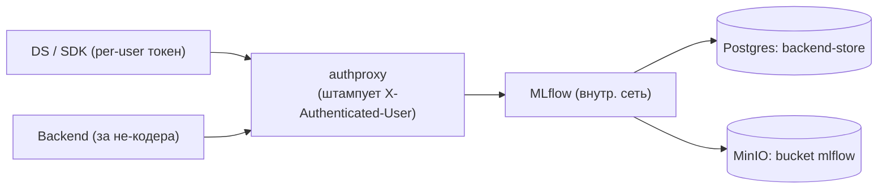

# 18 — MLflow: как развёрнут и как работает

Единый документ про MLflow в нашей платформе. Остальные доки ссылаются сюда. Если деталь
противоречит [`05_CANONICAL_FLOW.md`](05_CANONICAL_FLOW.md) — прав канон.

MLflow у нас — **трекинг экспериментов + Model Registry + artifact-store**. Он удобен и
стандартен, но **не имеет нормального пер-юзер RBAC**, поэтому развёрнут особым образом
(см. §18.2). Источник правды по **артефактам/версиям/ранам** — MLflow+MinIO; по **статусам
безопасности / Tier / HITL / lineage** — наш Postgres. Они синхронизируются по `(name, version)`.

---

## 18.1 Как развёрнут (инфраструктура)

| Параметр | Значение | Где |
|---|---|---|
| **Backend-store** (метаданные: эксперименты, раны, версии) | PostgreSQL | `infra/Dockerfile.mlflow`, `docker-compose.yml` |
| **Artifact-store** (веса, файлы) | MinIO, отдельный бакет `mlflow` | `MLFLOW_S3_ENDPOINT_URL`, [`10_STORAGE.md`](10_STORAGE.md) |
| **Сетевой доступ** | только через auth-прокси (`expose`, не `ports`) | `docker-compose.yml` сервис `mlflow` |
| **Tracking URI** | адрес прокси (`http://authproxy:4180/mlflow`), НЕ прямой `:5000` | `.env` `MLFLOW_TRACKING_URI` |

MLflow слушает **внутри** docker-сети и **наружу не публикуется** — снаружи доступен только
через `authproxy` (см. §18.2).

---

## 18.2 Доступ и идентичность (почему MLflow за прокси)

MLflow OSS не умеет неподделываемую пер-юзер аутентификацию. Решение (полностью —
[`06_IDENTITY_AND_AUTH.md`](06_IDENTITY_AND_AUTH.md)):

1. MLflow **не торчит наружу**; единственный вход — `authproxy`.
2. Прокси проверяет SSO-токен пользователя и **серверно** проставляет личность
   (`X-Authenticated-User`), которую клиент задать не может.
3. DS, работающий из ноутбука через `mlflow`-SDK, получает **короткоживущий per-user токен**
   (не общий секрет). Прокси валидирует его и штампует личность в раны/события.

Итог: даже при «удобной» прямой записи `mlflow.start_run()` из кода разработчика действие
**неподделываемо привязано к человеку**. Тег вроде `os.getenv("USER")` доверенным НЕ считается.



### Два входа данных — одна личность
| Кто | Как пишет в MLflow | Чья личность |
|---|---|---|
| DS / DE (пишет ML-код) | `mlflow.*` через прокси | его аккаунт (штамп прокси) |
| Frontender / не-кодер | UI-аплоад → бэкенд логирует за него | **его** аккаунт (из сессии), не «системный» |

---

## 18.3 Конвенции логирования для DS (что писать в коде)

Эталон — `src/train/train.py`. Минимальный набор вызовов:

```python
import mlflow, mlflow.data, pandas as pd

mlflow.set_tracking_uri(os.getenv("MLFLOW_TRACKING_URI"))   # адрес ПРОКСИ
mlflow.set_experiment("Secure_ML_Project")

df = pd.read_parquet("data.parquet")
ds = mlflow.data.from_pandas(df, source="<path_or_id>", name="training_dataset")
# from_pandas сам считает SHA-256 содержимого (Data Digest) + профиль/кол-во строк

with mlflow.start_run() as run:
    mlflow.log_input(ds, context="training")        # ПРИВЯЗКА данных к рану (lineage)
    mlflow.log_param("n_estimators", 50)
    mlflow.log_metric("accuracy", acc)
    mlflow.set_tags({                                # ИБ-теги для нашего бэкенда
        "security.git_commit": git_sha,
        "security.data_source_type": "local|internet|corp_storage|verified_id",
        "security.data_path_or_id": "<...>",
        # security.trained_in_ci и личность проставляет CI/прокси, НЕ клиент
    })
    mlflow.sklearn.log_model(model, "model")         # см. §18.4 про формат
```

Что из этого зачем:
- `from_pandas` → **Data Digest** (хэш данных), который мы ищем в Postgres (fast-path / lineage).
- `log_input` → неразрывная связка **данные↔ран** (часть lineage для G5).
- `set_tags("security.*")` → бэкенд читает их в `/verify`, чтобы понять сценарий проверки.
- `log_model` → артефакт в MinIO-бакет `mlflow` + служебные метаданные/зависимости.

> ВАЖНО: ИБ-теги, отражающие доверие (`trained_in_ci`, личность), **проставляет сервер/CI**, а
> не разработчик в коде — иначе их можно подделать (см. [`06_IDENTITY_AND_AUTH.md`](06_IDENTITY_AND_AUTH.md) §6.5).

---

## 18.4 Формат артефактов модели (стык с G4)

MLflow `log_model` должен сохранять веса в **G4-разрешённом формате**:
`.safetensors / .onnx / .cbm / .txt`. **Запрещены** `.pkl/.joblib/.bin` — их блокирует G4 Model
Gate (анти-pickle-RCE). См. [`07_SECURITY_GATES.md`](07_SECURITY_GATES.md) (G4). Эталон экспорта в
ONNX — `src/train/train.py`.

---

## 18.5 Реестр: MLflow ↔ наш Postgres

При регистрации модель пишется **И в наш реестр (Postgres `models`/`model_versions`)**, **И в
MLflow Model Registry** (`core/mlflow_utils.register_model_version`). Контракт — [`11_BACKEND_API.md`](11_BACKEND_API.md) §11.5.

| Что | Источник правды |
|---|---|
| Артефакты, раны, версии, метрики | **MLflow + MinIO** |
| Tier, статус безопасности, HITL, lineage, находки, аудит | **наш Postgres** |
| Связь между ними | по `(name, version)` |

Хелперы (`core/mlflow_utils.py`): `list_models`, `list_runs`, `get_run_metadata`,
`download_artifacts`, `register_model_version`, `set_alias`.

---

## 18.6 Продвижение версий через aliases (релиз без ручной заливки)

Разработчик **ничего не заливает руками для релиза**. Продвижение — сменой alias, которую
делает бэкенд/деплой-воркфлоу, не человек:

```
candidate ──(verify PASS)──► staging ──(HITL Approve + deploy)──► production
                                                                  ▲
                                              предыдущая версия → previous (для отката)
```

- `candidate` — после обучения в CI (`train.yml`).
- `staging` — после успешной верификации.
- `production` — после HITL-Approve (для Tier=HIGH) и `deploy.yml`.
- `previous` — прошлый прод, остаётся для blue-green отката (см. [`05_CANONICAL_FLOW.md`](05_CANONICAL_FLOW.md) §5.6).

---

## 18.7 Как `/verify` использует MLflow

Контракт ручки — [`11_BACKEND_API.md`](11_BACKEND_API.md) §11.3. Кратко: бэкенд по `run_id`
тянет из MLflow метаданные рана (`security.*` теги, Data Digest датасета, метрики, ссылку на
код), определяет сценарий данных и ветку (своя модель / внешние веса) и запускает нужные гейты.

Выпадашки на форме верификации (модель / Run ID / датасет) бэкенд собирает из
`mlflow.client.search_runs()` (теги + `run.inputs.dataset_inputs` для хэша датасета),
кэшируя на короткое время в Redis.

> Канон: для **своей** модели `/verify` проверяет **код+данные+lineage**, а артефакт рождает
> **CI** (`train.yml`), и его проверяет G4. Черновик модели из ноутбука DS **в прод не едет** —
> CI пересобирает модель из git+проверенного датасета (см. [`05_CANONICAL_FLOW.md`](05_CANONICAL_FLOW.md) §5.7).

---

## 18.8 Что НЕ так с MLflow и как мы это закрываем

| Проблема MLflow | Наше решение |
|---|---|
| Нет пер-юзер RBAC / слабая аутентификация | за auth-прокси, серверный штамп личности (§18.2) |
| Не перекладывает артефакты по статусу безопасности | статусы — в Postgres; в MinIO фиксированные бакеты ([`10_STORAGE.md`](10_STORAGE.md)) |
| Клиентские теги подделываемы | теги доверия (`trained_in_ci`, личность) проставляет сервер/CI |
| Артефакт рана = эксперимент, не гарантированно безопасен | в прод едет только CI-сборка + G4 + подпись; черновик не используется |

---

## 18.9 Где про MLflow в других доках (навигация)
- Развёртывание/схема — [`04_ARCHITECTURE.md`](04_ARCHITECTURE.md)
- Доступ/идентичность — [`06_IDENTITY_AND_AUTH.md`](06_IDENTITY_AND_AUTH.md)
- Место в релизном потоке — [`05_CANONICAL_FLOW.md`](05_CANONICAL_FLOW.md)
- Интеграция с реестром, `/verify` — [`11_BACKEND_API.md`](11_BACKEND_API.md)
- Версионирование данных — [`17_DATASET_LIFECYCLE.md`](17_DATASET_LIFECYCLE.md)
- Бакет artifact-store — [`10_STORAGE.md`](10_STORAGE.md)
- Задачи реализации — [`IMPLEMENTATION_PLAN.md`](IMPLEMENTATION_PLAN.md) (A1, A2, T3.3)
- Код — `core/mlflow_utils.py`, `src/train/train.py`, `infra/Dockerfile.mlflow`
