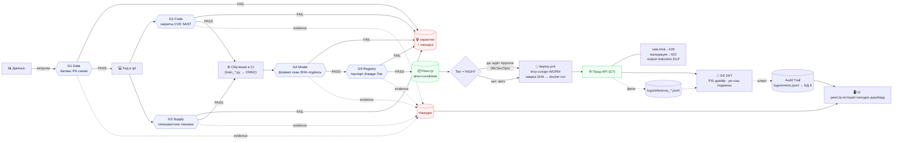

# B + C на одной странице (TL;DR)

**Платформа MLSecOps** = «контур безопасности» над ML-процессом: на каждом шаге жизни модели
стоит автопроверка (**Gate**). Прошёл — дальше; не прошёл — блок + видна причина. Плюс история
всех действий и ручное одобрение (HITL) для критичных моделей.

- **A** (в работе): БД, хранилище, авторизация, центральный бэкенд.
- **B** (готово): сами проверки (гейты) + CI/CD-конвейер.
- **C** (готово): 3 ML-модели + защита их API + мониторинг + веб-интерфейс.

### Что делает B — гейты (каждый = свой Docker-образ, контракт «JSON + exit 0/1»)
| Gate | Проверяет | Блокирует | Угрозы |
|---|---|---|---|
| **G1 Data** | данные | дисбаланс классов (отрава), ПДн, инъекции | #1 #2 #11 #15 |
| **G2 Code** | код | секреты (gitleaks), CVE (pip-audit), опасный код (bandit), CVE образа (trivy) | #8 #10 |
| **G3 Supply** | зависимости | typosquatting (`pytirch`), незапиненные версии, чужой источник | #9 #3 |
| **G4 Model** | файл модели | опасный формат (`.pkl`), вирус в весах, несовпадение SHA, нет подписи | #3 #4 #19 #26 |
| **G5 Registry** | паспорт+связность | нет owner/Tier/lineage, заниженный Tier | #20 #23 |

CI: `ci.yml` (все гейты, «чистое PASS / плохое BLOCK») · `train.yml` (G2→обучение→G4→#19→реестр) ·
`deploy.yml` (HITL→G2→trivy→G4 SHA→cosign→WORM→сверка SHA→`docker run`).

### Что делает C — модели, рантайм, мониторинг, UI
- **3 модели** в ONNX (формат из белого списка G4): credit_scoring (8080), text_classifier (8081), transaction_risk (8082).
- **Единая `features.py`** для обучения и инференса → нет training-serving skew (#19), защищено тестом (21 шт.).
- **G7 рантайм:** rate-limit→`429` (#5/#6), валидация→`422` (#11), output-reduction (#5/#13), DLP логов (#12). `attack_sim.py` показывает 429.
- **G6 мониторинг 24/7:** дрейф PSI>0.25 → `DRIFT`, ре-хэш SHA → `ПОДМЕНА МОДЕЛИ` (#14/#4).
- **UI (10 вкладок):** Верификация · Паспорт (Tier-бейдж, lineage) · Реестр · История (+проверка хеш-цепочки) · Находки (причина/FP) · Инструменты→угрозы · Деплой/Approve (HITL, RBAC-403) · Доступы · Дашборд.

### Три стыка, на которых всё держится
1. **Контракт гейта** (JSON+exit) → CI и бэкенд зовут любой гейт одинаково; `evidence` → причина в UI.
2. **Контракт обучения** (B↔C): train-скрипты пишут `model_path.txt`/`run_id.txt`, артефакт в ONNX → `train.yml` гонит G4.
3. **Единые фичи + consistency-тест** (C), встроенный в `train.yml` (B) → гарантия #19.

### Граница с A (пока на фолбэке, переключится автоматически)
история → `logs/events.jsonl` (`audit.py`) · фичи для PSI → `logs/inference_*.jsonl` · UI → моки · `train/deploy.yml` → `curl` к будущим ручкам A с мягкой деградацией.

### Потрогать
`make setup && make demo` — весь B+C сквозь, без A. UI: `APP_DEBUG=true .venv/bin/streamlit run ui/app.py`.

---

## Схема потока



### Тот же поток текстом (если mermaid не рендерится)
```
Данные → [G1] → код → [G2]+[G3] → обучение в CI (ONNX) → [G4] → [G5] → реестр
                                                                           │
                                              Tier=HIGH? ── да → HITL Approve (MLSecOps)
                                                          └ нет → авто
                                                                           ▼
                                            deploy (trivy·cosign·WORM·сверка SHA) → docker run
                                                                           ▼
                                              ПРОД-API [G7: 429/422/DLP/output-reduction]
                                                                           ▼
                                              [G6 24/7: PSI-дрейф + ре-хэш подмены]

любой гейт FAIL → карантин + находка(evidence) → видно в UI
все действия → Audit Trail (logs/events.jsonl → БД A) → видно в UI
serve пишет фичи → logs → G6 считает дрейф на живом трафике
```
