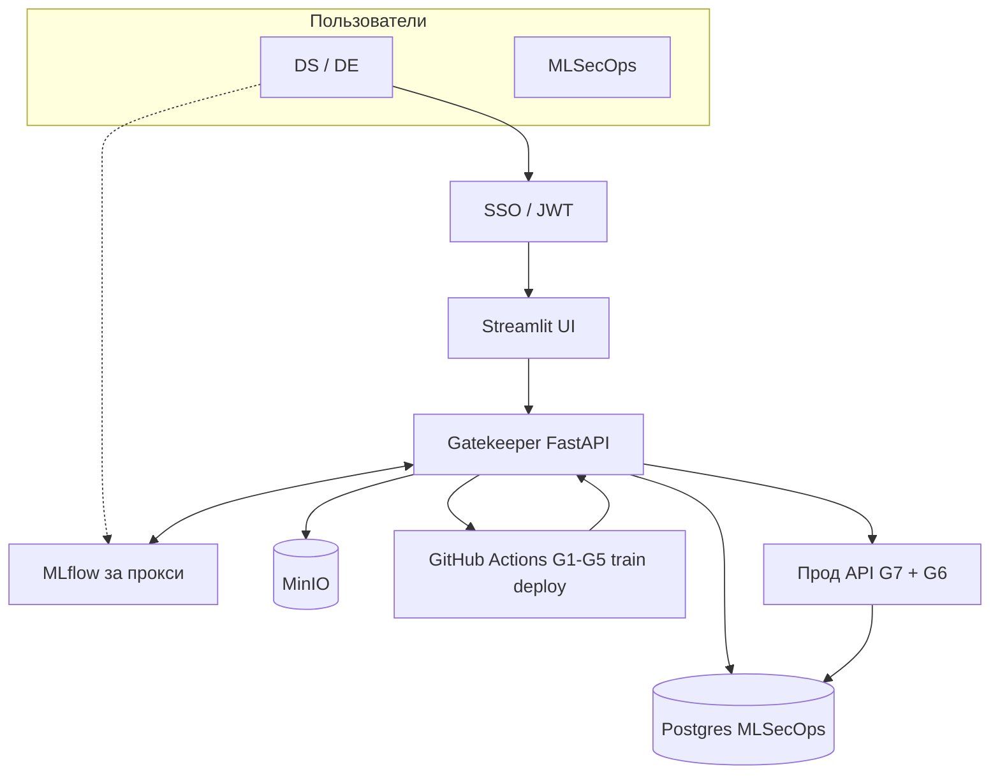
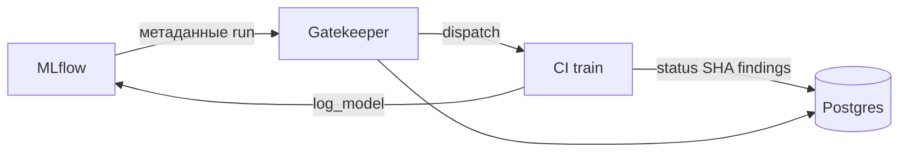
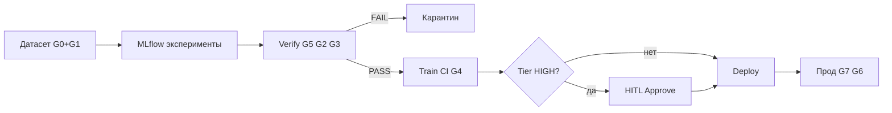
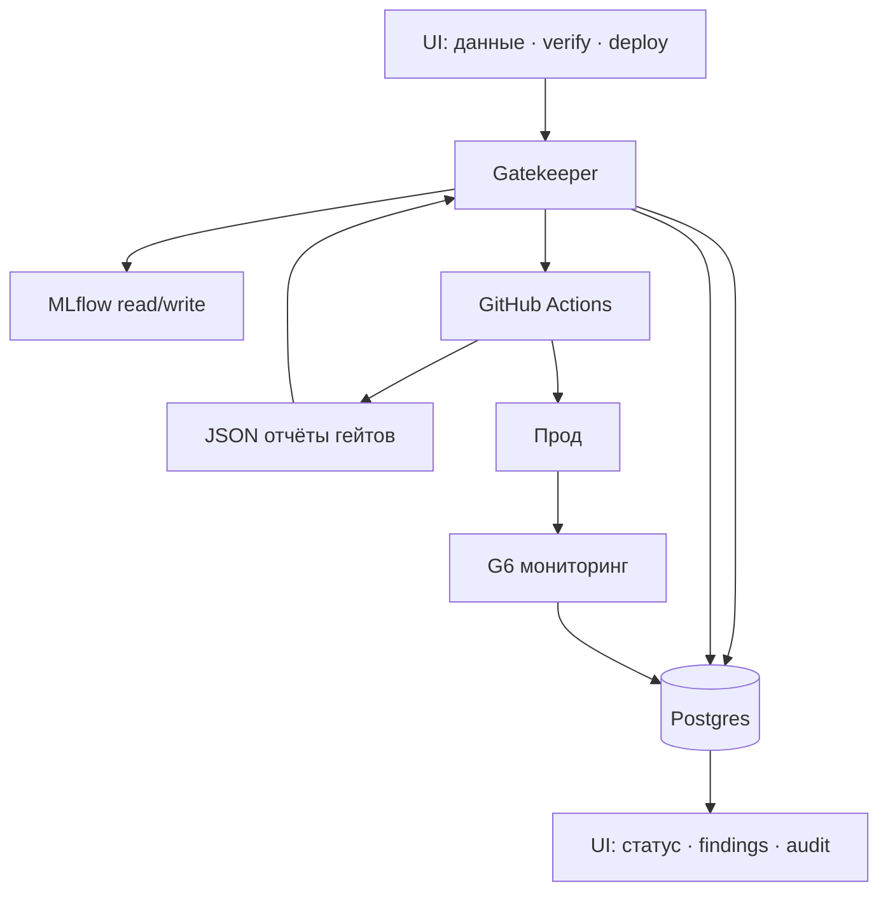

# Презентация MLSecOps — слайды (полный поток)

> Копируй блоки в PowerPoint. Диаграммы — в [Mermaid Live](https://mermaid.live) → Export PNG/SVG.  
> Канон: `05_CANONICAL_FLOW.md`, `07_SECURITY_GATES.md`. Сейчас в CI: G1–G5; API verify/deploy — TODO.

---

## Слайд 1. Заголовок

**MLSecOps — безопасный путь ML-модели в прод**

- MLflow — эксперименты и версии  
- Наш сервис — проверки, реестр, audit, допуск в прод  
- Один логин · один audit · автомат + HITL для HIGH

---

## Слайд 2. Две системы — одна платформа

| | **MLflow** | **Наш MLSecOps** |
|--|------------|------------------|
| Роль | Лаборатория DS | Охрана и пропускной пункт |
| Метаданные | Runs, params, Registry | Статусы, findings, lineage, Tier |
| Файлы | MinIO `mlflow` | `datasets`, `models`, `quarantine`, prod WORM |
| «В прод?» | Нет | **Только Postgres** |

**Фраза:** MLflow помнит эксперимент — банк доверяет только тому, что прошёл наш конвейер.

---

## Слайд 3. Где что хранится (БД и файлы)

```
PostgreSQL
├── MLflow backend store     → experiments, runs, registry
└── MLSecOps (mlsec)         → datasets, models, findings, events (hash-chain)

MinIO (S3)
├── mlflow/      → артефакты экспериментов
├── datasets/    → одобренные данные
├── quarantine/  → заблокированное (не удаляем)
└── models/prod/ → прод (WORM)
```

**Важно:** БД **не запускает** CI — только хранит вердикты. Пайплайн стартует **Gatekeeper** из UI.

---

## Слайд 4. Архитектура (схема)



---

## Слайд 5. Связь MLflow ↔ наш сервис

**Из MLflow читаем (verify):** `run_id`, теги, hash датасета, `git_sha`, пользователь.

**В MLflow пишем (после CI):** модель из **train**, alias `candidate` → `production`.

**Только у нас:** `quarantine`, `pending_hitl`, `approved`, `prod`, findings, audit.



---

## Слайд 6. Как запускается пайплайн

| Действие в UI | Запуск | Гейты |
|---------------|--------|-------|
| Загрузить датасет | Gatekeeper / ingest | G0 + G1 |
| Проверить модель | `POST /verify` → GitHub | G5 → G2 → G3 |
| Обучение (после PASS) | `train.yml` | G2 → train → G4 → G5 |
| Деплой | `deploy.yml` | G2+trivy → G4 → cosign |

Цепочка: **UI → Gatekeeper → GitHub Actions → JSON → Gatekeeper → Postgres → UI**

---

## Слайд 7. Путь артефакта (жизненный цикл)



**Канон:** в прод идёт модель из **CI**, не черновик из ноутбука.

---

## Слайд 8. Что видит пользователь

| В UI | Откуда |
|------|--------|
| Модели и runs | MLflow (через API) |
| Статусы, Tier | Postgres |
| Результат проверки | `gate_results`, `next_action` |
| Находки (красное) | `findings` — gate, severity, evidence |
| История | `events` — кто, когда, approve/block |
| CEO-дашборд | read-only: что в prod, Tier |

---

## Слайд 9. Одобрение и блокировка активов

| Актив | PASS | FAIL / риск |
|-------|------|-------------|
| **Датасет** | `available` | `quarantine` + findings G1 |
| **Модель verify** | → train | `quarantine` |
| **После train** | `verified` / `approved` | `quarantine` |
| **Tier HIGH** | `pending_hitl` → Approve MLSecOps | DS **не** approvит свою модель |
| **Внешние веса** | почти всегда HITL | `pending_hitl` |

Любое изменение датасета → **все проверки с нуля**.

---

## Слайд 10. Роли

| Роль | Действия |
|------|----------|
| **DS** | MLflow, verify, train |
| **DE** | Датасеты |
| **MLSecOps** | Approve, deploy, rollback, RBAC, FP |
| **Product / CEO** | Просмотр |

Один аккаунт (JWT) для UI и MLflow SDK.

---

## Слайд 11. Деплой — проверки перед продом

1. Status = `approved` (HIGH — после HITL)  
2. **G2 deploy:** gitleaks, bandit, pip-audit  
3. **Trivy** на Docker-образе (единственный раз)  
4. **G4:** SHA модели = реестр, modelscan, формат  
5. **cosign** — подпись  
6. WORM `models/prod/`  
7. Проверка подписи + SHA **перед** `docker run`  
8. Health-check → MLflow `production`, Postgres `prod`

После выката: **G7** (API) + **G6** (drift, подмена).

---

## Слайд 12. Гейты по ресурсам (кратко)

| Ресурс | Проверки | Технологии |
|--------|----------|------------|
| Данные | схема, PII, poisoning, инъекции | pandas, regex |
| Код | секреты, SAST, CVE deps | gitleaks, bandit, pip-audit |
| Зависимости | allow-list, pinning, источник | G3 checker |
| Модель | формат, scan, SHA, cosign | modelscan, hashlib, cosign |
| Контейнер | CVE образа | trivy |
| Паспорт | card, lineage, Tier | pydantic, G5 |
| Прод | rate limit, drift | Redis, FastAPI, evidently |

---

## Слайд 13. Сводная схема «внутрянка»



---

## Слайд 14. Статус реализации (честно для защиты)

| Готово | В работе |
|--------|----------|
| G1–G5 в `ci.yml` | `POST /verify` полный wiring |
| Схема Postgres, `core/db.py` | ingest JSON → БД из CI callback |
| `deploy.yml` шаги G2+G4 | HITL check, cosign, WORM |
| Демо-фикстуры гейтов | G6, G7, полный UI |

---

## Speaker notes (30 сек финал)

> Платформа оборачивает MLflow банковской безопасностью.  
> DS работает как привык. Gatekeeper забирает контекст run, гоняет гейты в CI, пишет вердикт в Postgres.  
> В прод — только проверенная CI-версия с audit и при необходимости ручным Approve.

---

## Какой слайд когда показывать

| Рассказ | Слайды |
|---------|--------|
| Что за продукт | 1–2 |
| Архитектура | 3–4 |
| MLflow | 5 |
| Как работает процесс | 6–7 |
| UX и роли | 8–10 |
| Деплой и гейты | 11–12 |
| Итог + честность | 13–14 |
