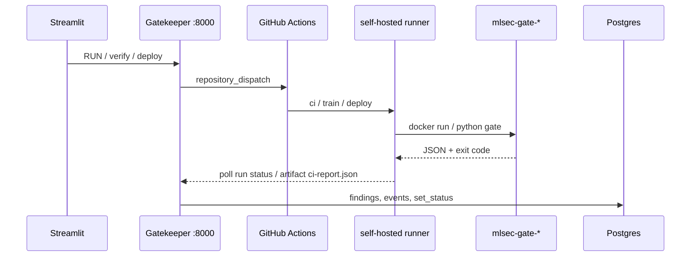

# Rina_WOrk — план реализации CI/CD (MLSecOps / alfa_case_2)

> **Автор зоны:** CI/CD (Rina).  
> **Связанные документы:** [`05_CANONICAL_FLOW.md`](05_CANONICAL_FLOW.md) (канон), [`07_SECURITY_GATES.md`](07_SECURITY_GATES.md), [`12_CICD.md`](12_CICD.md), [`IMPLEMENTATION_PLAN.md`](IMPLEMENTATION_PLAN.md) (фазы 2 и 4), [`AGENT_CONTEXT.md`](../AGENT_CONTEXT.md).

---

## 1. Зона ответственности

Реализуется **весь CI/CD** в репозитории, пока параллельно делают бэкенд (Gatekeeper) и фронт (Streamlit):

| Твоя зона | Не твоя зона (контракт) |
|-----------|-------------------------|
| `.github/workflows/` — `ci.yml`, `train.yml`, `deploy.yml` | `src/api/main.py` — эндпоинты, dispatch из UI |
| `scripts/ci/` — обёртки запуска гейтов, preflight, parse JSON | `ui/app.py` — кнопки, прогресс runs |
| `infra/docker-compose.gates.yml`, доработка `ci-runner` | `core/db.py` — запись findings/events (ты отдаёшь JSON) |
| Доведение `src/gates/*` до «clean pass / bad blocked» | `src/ingest_dataset/` — G1 при загрузке через UI |
| `src/train/train.py` — минимум CI-артефакта для пайплайна | G0 в UI + `core/model_card.py` |

---

## 2. Что такое гейты и как они делятся по активам

**Гейт** — автоматическая проверка на **конкретной стадии** жизненного цикла ML:

- **PASS** (exit 0) — можно двигаться дальше.
- **FAIL** (exit 1) — стоп, артефакт в `quarantine`, причина в JSON (для UI / `findings`).

Гейты **не один общий сканер**, а **разные проверки на разных типах активов**:

| Тип актива | Гейт в репо | Папка / код | Когда |
|------------|-------------|-------------|--------|
| **Данные** (CSV/parquet) | **G1** Data | `src/gates/data_gate/` | Загрузка датасета, job `data-gate` в CI |
| **Код** (репозиторий) | **G2** Code | `src/gates/code_gate/` | PR, verify, **первым** в `train.yml`, deploy |
| **Зависимости** (requirements) | **G3** Supply | `src/gates/dependency_gate/` | verify, CI (отдельный job от G2) |
| **Артефакт модели** (веса) | **G4** Model | `src/gates/model_gate/` | После `train.py`, перед/в `deploy.yml` |
| **Паспорт + lineage** | **G5** Registry | `src/gates/registry_gate/` | `/verify`, register после train |
| **Онбординг** | **G0** | `core/model_card.py` + UI | Регистрация модели/датасета (не отдельный образ в `gates/`) |
| **Прод-мониторинг** | **G6** | `src/monitor/` | Сервис, не каждый GHA job |
| **Инференс API** | **G7** | `src/serve/` | После deploy, Redis rate-limit |

> **Слайды команды:** «Gate 4 = регистрация» на презентации = наш **G5**. «Сборка модели» на слайде = наш **G4**. В коде и CI ориентироваться на **`docs/07_SECURITY_GATES.md`**.

**Сквозные механизмы** (не отдельные G8): Audit Trail (`events`), RBAC, HITL, False Positives — бэк + UI; CI отдаёт отчёты гейтов.

---

## 3. Зависимость статусов (данные ↔ код ↔ модель)

Из канона [`05_CANONICAL_FLOW.md`](05_CANONICAL_FLOW.md) §5.8:

| Ситуация | Данные | Код | Модель |
|----------|--------|-----|--------|
| Данные **FAIL** | `quarantine` | может быть OK | **blocked** — нельзя считать OK |
| Код **FAIL** | может быть OK | blocked | **blocked** |
| Модель **FAIL**, данные OK | **остаются OK** | по ситуации | `quarantine` / blocked |
| Позже датасет признан плохим | quarantine | — | по **lineage** флаг на всех моделях на этом датасете |

**Важно для CI:**

- Сам **G4** не «наказывает» датасет — это делает **оркестратор** (`preflight_train.sh` или API бэка): перед `train.yml` проверить, что датасет в реестре `available`, не `quarantine`.
- **G1, G2, G3** в `ci.yml` — **параллельные jobs** (разные активы).
- **G2 → train → G4 → G5** в `train.yml` — **строгая цепочка** для модели.

```mermaid
flowchart TB
  subgraph data_path["Путь данных"]
    ING[ingest / UI upload]
    G1[G1 data_gate]
    DS_REG[(datasets status)]
    ING --> G1 --> DS_REG
  end

  subgraph code_path["Путь кода"]
    GIT[git checkout SHA]
    G2[G2 code_gate]
    G3[G3 dependency_gate]
    CODE_OK[PASS]
    GIT --> G2 --> CODE_OK
    GIT --> G3 --> CODE_OK
  end

  subgraph model_path["Путь модели"]
    TRAIN[train.py в CI]
    G4[G4 model_gate]
    G5[G5 registry_gate]
    MV_REG[(models + model_versions]
    TRAIN --> G4 --> G5 --> MV_REG
  end

  DS_REG -->|available| TRAIN
  CODE_OK --> TRAIN
  DS_REG -.->|FAIL| BLOCK[train не стартует]
```

---

## 4. Как выглядит проект в целом

**Продукт:** MLSecOps-платформа — безопасность встроена в MLOps-пайплайн.

**Слои:**

1. **Инфра** — `docker compose`: Postgres, MinIO, Redis, MLflow (за auth-прокси), backend, UI, **ci-runner**, inference.
2. **Реестр + аудит** — Postgres: статусы, Tier, lineage, `findings`, `events` (hash-chain).
3. **Гейты** — изолированные скрипты + Docker-образы `mlsec-gate-*`, JSON stdout, exit 0/1.
4. **Gatekeeper** — FastAPI: verify, dispatch CI, RBAC (команда бэка).
5. **UI** — Streamlit: загрузка, verify, Approve, реестр (команда фронта).
6. **CI/CD** — GitHub Actions на **self-hosted runner**: PR-проверки, обучение, деплой.

**Сквозной поток A (свой код + данные):**

```
датасет → G0+G1 → MLflow эксперименты → /verify (G5+G2+G3)
  → train.yml (G2 → train → G4 → register)
  → [HITL если HIGH] → deploy.yml (G2 deploy + trivy → G4 SHA → cosign → prod)
  → G7 runtime + G6 monitor
```

**Поток B (внешние веса):** ingest + freeze SHA → G3+G4+G5 → `pending_hitl` → Approve → deploy (без train в CI).

---

## 5. Три пайплайна GitHub Actions

### 5.1 `ci.yml` — проверки по типу актива (параллельно)

**Триггеры:** `pull_request`, `workflow_dispatch`, `repository_dispatch` (`verify`, `scan`).

| Job | Актив | Гейт | Технологии | Clean (PASS) | Bad (FAIL) |
|-----|-------|------|------------|--------------|------------|
| `syntax` | код | — | `py_compile` | весь список файлов | — |
| `data-gate` | **данные** | G1 | pandas, regex | `data/train_m1_clean.csv` | `data/train_m1_poisoned.csv` |
| `code-gate` | **код** | G2 `--stage ci` | gitleaks, bandit, pip-audit | `src/` | `demo/insecure/` |
| `dependency-gate` | **зависимости** | G3 | allow-list, pin | `demo/requirements_clean.txt` | `demo/insecure/requirements_vuln.txt` |
| `registry-gate` | **метаданные** | G5 | pydantic | валидная model card fixture | битая card |
| `build-gates` | образы | — | `docker build` | все `src/gates/*/Dockerfile` | — |
| `db-smoke` | БД | — | `tests/smoke_db.py` | когда `core/db` готов | — |

**Правила:**

- Не смешивать G2 и G3 в один смысловой шаг — разные jobs.
- Убрать `|| true` на code-gate — fail должен быть жёстким.
- **trivy** — только в `deploy.yml`, не здесь.

**Файл:** `.github/workflows/ci.yml` (уже есть — доработать).

---

### 5.2 `train.yml` — канонический артефакт модели (строго по порядку)

**Триггеры:** `workflow_dispatch`, `repository_dispatch` (`train`).

**Inputs:** `model_name`, `dataset_name`, `dataset_version`, `git_commit`.

| # | Шаг | Гейт / действие | Зависимость |
|---|-----|-----------------|-------------|
| 0 | Preflight | API/PG: датасет `available` | иначе exit 1 |
| 1 | checkout | на `git_commit` | |
| 2 | G2 | `code_gate --stage ci` | код FAIL → стоп |
| 3 | G3 | `dependency_gate` на `requirements.txt` | опц. если не в verify |
| 4 | train | `src/train/train.py` → `artifacts/model.safetensors` | только verified dataset |
| 5 | G4 | `model_gate` на артефакт + SHA | модель FAIL → не register |
| 6 | G5 + register | lineage, `trained_in_ci=true` | API бэка / заглушка |
| 7 | MLflow | `alias=candidate` | env MLflow + MinIO |

**Файл:** `.github/workflows/train.yml`.

---

### 5.3 `deploy.yml` — прод

**Триггеры:** `workflow_dispatch`, `repository_dispatch` (`deploy`).

**Inputs:** `model_name`, `version`.

| # | Шаг | Содержание |
|---|-----|------------|
| 1 | HITL | статус `approved`; HIGH без Approve → стоп |
| 2 | G2 deploy | secrets + SAST + CVE |
| 3 | trivy | **единственный** запуск на образе |
| 4 | G4 | `--expected-sha` из реестра |
| 5 | cosign | sign + verify (secrets) |
| 6 | MinIO | `models/prod/*` + WORM |
| 7 | Deploy | verify SHA+cosign **до** `docker run` |
| 8 | Health | curl + alias `production` (callback бэку) |

**Файл:** `.github/workflows/deploy.yml`.

---

## 6. Файлы: что создать и доработать

### 6.1 Уже есть — доработать

| Путь | Действие |
|------|----------|
| `.github/workflows/ci.yml` | `build-gates`, жёсткий code-gate, gitleaks, `registry-gate` |
| `.github/workflows/train.yml` | preflight, реальные пути артефактов, register |
| `.github/workflows/deploy.yml` | HITL, trivy, cosign, SHA check |
| `src/gates/data_gate/*` | Поддержка CI (почти готово) |
| `src/gates/code_gate/*` | gitleaks, парсинг bandit/pip-audit |
| `src/gates/dependency_gate/*` | Готово для CI |
| `src/gates/model_gate/*` | modelscan, `--expected-sha` |
| `src/gates/registry_gate/*` | lineage + model card |
| `src/train/train.py` | Минимум: safetensors + путь для G4 |
| `infra/docker-compose.yml` | runner: сеть с postgres/minio, `GITHUB_TOKEN` |
| `.env.example` | `GITHUB_*`, `COSIGN_*`, `MLFLOW_*`, `GATEKEEPER_URL` |

### 6.2 Создать новое

| Путь | Назначение |
|------|------------|
| `infra/docker-compose.gates.yml` | Сборка/локальный прогон образов `mlsec-gate-*` |
| `scripts/ci/run_gate.sh` | Единый запуск: docker или `python *_gate.py --json` |
| `scripts/ci/parse_report.py` | Парсинг JSON → summary для логов GHA |
| `scripts/ci/preflight_train.sh` | Датасет `available` (позже — API бэка) |
| `scripts/ci/preflight_deploy.sh` | `approved`, HITL для HIGH |
| `scripts/ci/build_all_gates.sh` | `docker build` всех гейтов |
| `scripts/ci/post_register.sh` | Вызов register после train (заглушка → API) |
| `.github/actions/run-gate/action.yml` | (опционально) composite action |

### 6.3 Демо и фикстуры (не трогать логику продакшена)

| Путь | Назначение |
|------|------------|
| `data/make_datasets.py` | Генерация clean/poisoned/drift |
| `demo/insecure/*` | Секреты, pytirch — только bad-steps в CI |
| `demo/requirements_clean.txt` | G3 clean pass |

---

## 7. Технологии

| Компонент | Технология |
|-----------|------------|
| Оркестрация | GitHub Actions |
| Runner | self-hosted (`myoung34/github-runner` в compose) |
| Язык гейтов | Python 3.11 |
| G1 | pandas, regex (+ Presidio опц.) |
| G2 | gitleaks, bandit, pip-audit; deploy: trivy (в workflow) |
| G3 | кастомный checker + allow-list |
| G4 | modelscan/picklescan, SHA-256, cosign verify |
| G5 | pydantic |
| Контейнеры гейтов | Docker (`python:3.11-slim` в каждом Dockerfile) |
| Артефакты / MLflow | MinIO S3, MLflow Tracking |
| Подписи | cosign / sigstore (secrets в GHA) |
| Секреты | GitHub Actions Secrets — **никогда в коде** |

---

## 8. Контракт гейта (для бэка и UI)

Каждый `src/gates/<gate>/<gate>.py`:

```python
def gate_check(...) -> list[dict]:  # PASS | FAIL | SKIP
def build_report(...) -> dict:       # gate, asset, passed, checks, failed_checks
def main():                         # --json → stdout, exit 0|1
```

**Пример отчёта:**

```json
{
  "gate": "G2",
  "asset": "/in",
  "passed": false,
  "checks": [...],
  "failed_checks": [...]
}
```

**Правила:**

- Гейт **не пишет в БД** — пишет оркестратор (ingest / Gatekeeper), парся stdout.
- Нет инструмента → `SKIP`, не падать всем пайплайном (graceful degradation).

**Запуск через Docker:**

```bash
docker run --rm --network none \
  -v "$ARTIFACT:/in:ro" \
  mlsec-gate-data --path /in --json
```

Для `code` / `dependency` — сеть разрешена (advisory DB), том `:ro`.

---

## 9. Связь CI с бэкендом и UI



| Событие UI | Dispatch type | Workflow |
|------------|---------------|----------|
| Просканировать / verify | `verify` или `scan` | `ci.yml` |
| RUN (обучение) | `train` | `train.yml` |
| DEPLOY | `deploy` | `deploy.yml` |

**Secrets для настройки в GitHub:**

- `GITHUB_TOKEN` (или PAT для dispatch)
- `COSIGN_PRIVATE_KEY`, `COSIGN_PASSWORD`
- `POSTGRES_*`, `MINIO_*`, `MLFLOW_TRACKING_URI`
- `GATEKEEPER_URL`

Пока бэк не готов: `actions/upload-artifact` с `ci-report.json` в том же формате `build_report()`.

---

## 10. Roadmap реализации

### Этап 1 — Фундамент (1–2 дня)

- [ ] Runner в compose, зелёный `workflow_dispatch` на `ci.yml`
- [ ] `scripts/ci/run_gate.sh`, `build_all_gates.sh`
- [ ] `infra/docker-compose.gates.yml`

### Этап 2 — `ci.yml` (2–3 дня)

- [ ] G1/G3 жёстко
- [ ] G2 + gitleaks, без `|| true`
- [ ] Job `build-gates`
- [ ] Job `registry-gate` (G5) на фикстурах

### Этап 3 — Скрипты гейтов (3–5 дней)

- [ ] G2: парсинг severity
- [ ] G4: modelscan, demo `.pkl` → FAIL
- [ ] G5: lineage validation
- [ ] `parse_report.py`

### Этап 4 — `train.yml` (3–5 дней)

- [ ] `preflight_train.sh`
- [ ] Минимальный `train.py` → safetensors
- [ ] G4 → SHA в output
- [ ] Register (заглушка → API)

### Этап 5 — `deploy.yml` (3–5 дней)

- [ ] `preflight_deploy.sh` (HITL)
- [ ] trivy + cosign
- [ ] G4 SHA mismatch demo

### Этап 6 — Интеграция с бэком

- [ ] Заменить preflight mock на `GET /api/v1/registry`
- [ ] Webhook / poll → `add_finding`, `log_event`

### Этап 7 — Демо (по остатку)

- [ ] Прогон сценариев из [`16_DEMO_SCENARIOS.md`](16_DEMO_SCENARIOS.md)
- [ ] G7/G6 — сервисы после deploy (координация с командой inference)

---

## 11. Чеклист «нельзя нарушать»

1. Один гейт — одна папка `src/gates/<gate>/`, один Docker-образ.
2. Гейт не пишет в БД — только JSON; наследование статусов данных→модель — **preflight / бэкенд**.
3. **trivy** только в `deploy.yml`.
4. Порядок **train:** G2 → train → G4 → G5/register.
5. G4 только на артефакте **из CI**, не на черновике MLflow.
6. Демо-плохое только в `demo/`.
7. Не менять схему JSON отчёта без согласования с бэком и UI.
8. Заблокированное не удалять — `quarantine` как улика.

---

## 12. Таблица «файл → актив → где в CI»

| Актив | Гейт | Код | CI |
|-------|------|-----|-----|
| Датасет | G1 (+ G0 при ingest) | `data_gate/`, `ingest_dataset/` | `ci.yml` → `data-gate` |
| Код git | G2 | `code_gate/` | `ci.yml`, `train.yml` шаг 1, `deploy.yml` |
| requirements | G3 | `dependency_gate/` | `ci.yml` → `dependency-gate` |
| Файл весов | G4 | `model_gate/` | `train.yml`, `deploy.yml` |
| Карточка + lineage | G5 | `registry_gate/` | verify, register |
| Прод API | G7 | `serve/` | после deploy (compose) |
| Прод метрики | G6 | `monitor/` | сервис/cron |

---

## 13. Быстрый старт локально

```bash
cp .env.example .env
docker compose -f infra/docker-compose.yml up --build
python data/make_datasets.py

# Прогон гейта вручную
python src/gates/data_gate/data_gate.py --path data/train_m1_clean.csv --json

# Сборка образов (после создания scripts)
./scripts/ci/build_all_gates.sh
```

---

*Документ для личной работы над CI/CD. При расхождении с каноном править сначала [`05_CANONICAL_FLOW.md`](05_CANONICAL_FLOW.md), затем этот файл.*
