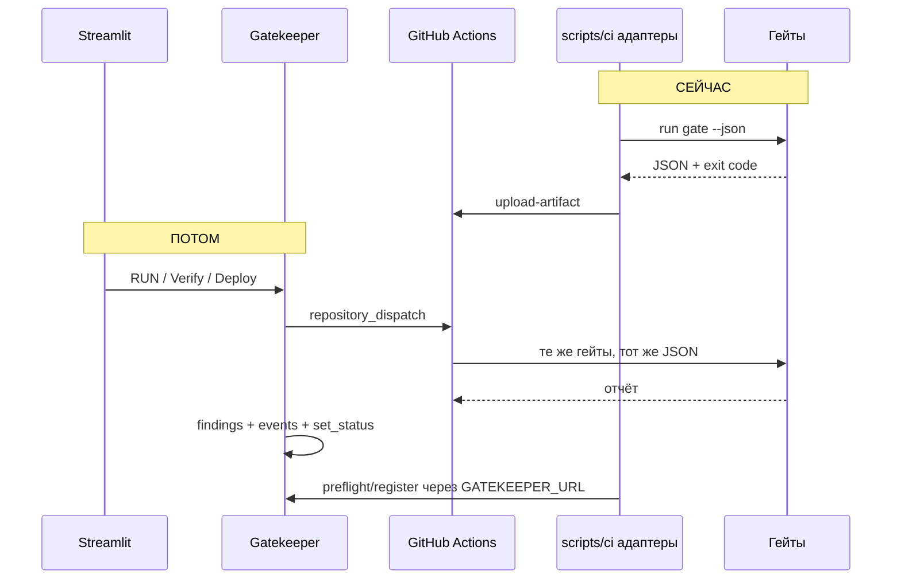

# Rina_do_befor_work — что делаю я сейчас и как соединим с бэком/фронтом

> Документ для команды: что Рина накидывает на ветке **`Rina`** по CI/CD сейчас,  
> что остаётся у бэкенда и фронта, и **как подключимся без переделки гейтов**.  
> Подробный план работ: [`Rina_todo.md`](Rina_todo.md), теория: [`Rina_WOrk.md`](Rina_WOrk.md).

---

## Сообщение для чата в начале работ

**Всем:** я веду CI/CD на ветке `Rina`.

| Кому | Что нужно от вас |
|------|------------------|
| **Бэкенд** | Контракт JSON гейта (ниже §2) и позже `POST repository_dispatch` + polling run → `findings` / `events` / `set_status` |
| **Фронт** | Кнопки Verify / RUN / DEPLOY бьют в **бэк**, не напрямую в GitHub |
| **ML / DS** | Для `train.py` — стабильный выход: файл `.safetensors` в `artifacts/` |
| **Инфра** | PAT для self-hosted runner и secrets в GitHub — согласуем на этапе 0 |

---

## 1. Главная идея

**Да, можно:** CI сначала живёт **сам по себе**, интеграция с бэком — **подменяемый слой**. Гейты и workflows не переписываем, когда бэк будет готов — **переключаем скрипты-адаптеры** (`preflight_train.sh`, `post_register.sh`, URL Gatekeeper).

Коллегам не «ждите меня», а:

> CI уже отдаёт отчёты в формате §2 и артефакты workflow. Вам нужно: (1) `repository_dispatch` с payload как в §3, (2) poll run → parse JSON → `findings` / `events`. Мои скрипты переключим на `GATEKEEPER_URL`, когда появятся `POST /api/v1/...`.

---

## 2. Контракт для коллег (не менять без согласования)

### JSON отчёта гейта (stdout, флаг `--json`)

Гейт **не пишет в БД** — только JSON и exit code.

```json
{
  "gate": "G1",
  "asset": "path/to/file",
  "passed": true,
  "checks": [
    {
      "check": "pii",
      "status": "PASS",
      "detail": "...",
      "evidence": {}
    }
  ],
  "failed_checks": []
}
```

- **exit 0** — PASS (можно двигаться дальше по пайплайну).
- **exit 1** — FAIL (блок; причина в `failed_checks`).

**Бэкенд (когда будет готов):** парсит этот JSON → таблицы `findings` + `events` + `set_status` в Postgres.

---

### Dispatch от бэка в GitHub Actions

| Кнопка в UI | `event_type` | Workflow |
|-------------|--------------|----------|
| Просканировать / Verify | `verify` или `scan` | `ci.yml` |
| RUN (обучение) | `train` | `train.yml` |
| DEPLOY | `deploy` | `deploy.yml` |

**Payload для `train`:**

- `model_name`
- `dataset_name`
- `dataset_version`
- `git_commit`

**Payload для `deploy`:**

- `model_name`
- `version`

Фронт **не** вызывает GitHub API напрямую — только Gatekeeper → dispatch.

---

## 3. Разделение зон: кто что делает

| Часть | Владелец (целевой) | Что делаю я сейчас (CI, ветка Rina) | Что заберут коллеги позже |
|-------|-------------------|-------------------------------------|---------------------------|
| **Гейты G1–G5** | CI / общий код | `src/gates/*` → JSON + exit 0/1 | Не трогают логику гейтов |
| **Запуск workflow** | Бэкенд | Вручную: GitHub Actions UI или `trigger_workflow.sh` + PAT | `POST /repos/.../dispatches` из Gatekeeper |
| **Результат прогона** | Бэкенд | `upload-artifact`: `gate-report-*.json`, логи job | Poll run → parse JSON → PG |
| **Preflight train** | Бэкенд + реестр | `CI_SKIP_PREFLIGHT=true` или временный mock | `GET /api/v1/registry` — датасет `available` |
| **Preflight deploy** | Бэкенд | mock: статус `approved`, HITL для HIGH | API реестра + Approve |
| **Register после train** | Бэкенд | `post_register.sh` — заглушка / JSON-файл | `POST /api/v1/...` register + lineage |
| **UI** | Фронт | — | Кнопки → бэк, прогресс runs |
| **Запись в БД** | Бэкенд (`core/db.py`) | **Не делаю** полноценный мини-бэкенд | `log_event`, `add_finding`, RBAC |

---

## 4. Что я накидываю для себя сейчас (без ожидания бэка)

1. **Гейты** — тот же JSON, что в §2; формат **не меняю** при подключении бэка.
2. **В каждом job workflow** после гейта:
   - сохранить stdout в файл;
   - `actions/upload-artifact` (например `gate-G2-report.json`).
3. **Скрипты с двумя режимами** (адаптеры):
   - `USE_GATEKEEPER=false` / `CI_SKIP_PREFLIGHT=true` — mock, локальная разработка;
   - `USE_GATEKEEPER=true` — `curl $GATEKEEPER_URL/...` когда API готов.
4. **Train / deploy** — запуск через Actions или `scripts/ci/trigger_workflow.sh` (PAT) до появления кнопок в UI.
5. **Парсинг JSON** — `scripts/ci/parse_report.py` только для логов GHA и fail job, не дублирование всей логики бэка.

**Критерий:** на демо и в PR всё зелёное/красное по фикстурам `demo/` и `data/` **без** обязательного Gatekeeper.

---

## 5. Как соединим, когда коллеги реализуют своё



**Шаги переключения (без переделки гейтов):**

| # | Действие |
|---|----------|
| 1 | Бэк публикует API: registry, register, (опц.) webhook после run |
| 2 | В `preflight_train.sh` / `preflight_deploy.sh` / `post_register.sh` меняем URL с mock на `GATEKEEPER_URL` |
| 3 | Убираем временный PAT-trigger из UI-потока; остаётся только dispatch с бэка |
| 4 | CI по желанию убирает дублирующую запись в БД, если успели сделать TEMP-скрипт — один источник правды: бэк |

---

## 6. Что имеет смысл сделать самой / что не дублировать

### Имеет смысл (CI-зона)

- Парсинг JSON в `parse_report.py` для GitHub Actions.
- Артефакты с отчётами — для демо и для будущего бэка.
- Временный `trigger_workflow.sh` (PAT), пока нет кнопок в Streamlit.
- Mock preflight на dev (env-переменные).

### Лучше не делать (зона бэка)

- Полноценный `core/db`, RBAC, HITL только ради CI — конфликт merge и двойная поддержка.
- Прямая запись в Postgres из каждого job **без согласования** — только если бэк сильно задерживается; тогда один файл `scripts/ci/TEMP_write_finding.py` и явная пометка **временно**.

---

## 7. Три правила, чтобы «потом взять их вариант» сработало

1. **Не менять схему JSON гейта** без сообщения в чат (бэк и UI завязаны на `gate`, `passed`, `checks`, `failed_checks`).
2. **Не менять `event_type`:** `verify` / `scan`, `train`, `deploy` — как в `.github/workflows/`.
3. **Интеграцию держать в `scripts/ci/`**, не внутри `gate_check()` в `src/gates/`.

---

## 8. Коротко по ролям (что сказать на созвоне)

| Роль | Одна фраза |
|------|------------|
| **Рина (CI)** | Гейты и workflows на `Rina`; отчёты JSON + artifacts; БД из гейтов не пишу. |
| **Бэкенд** | Dispatch + poll run + JSON → findings/events; API preflight/register — подключу к моим shell-скриптам. |
| **Фронт** | Кнопки только на бэк; пока RUN можно вручную в GitHub Actions. |
| **ML/DS** | Стабильный путь `artifacts/model.safetensors` после train. |
| **Инфра** | Runner `self-hosted` + secrets: `GITHUB_TOKEN`, позже `COSIGN_*`. |

---

## 9. Зависимость данных ↔ код ↔ модель (напоминание для интеграции)

Из канона [`05_CANONICAL_FLOW.md`](05_CANONICAL_FLOW.md) §5.8:

- Модель **зависит** от данных и кода; данные и код от модели — **нет**.
- Данные FAIL → train **не стартует** (это **preflight**, не G4).
- Модель FAIL → данные в реестре **остаются OK**.

Бэкенд при `set_status` должен это соблюдать; CI в `preflight_train.sh` только проверяет `dataset.status == available`.

---

*Документ для согласования с командой перед и во время работы по [`Rina_todo.md`](Rina_todo.md).*
