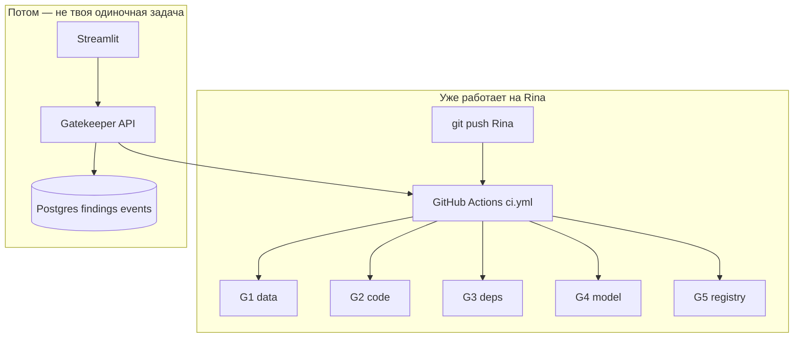

# Rina_todo — пошаговый чеклист CI/CD

> Рабочий документ «по косточкам». Опирается на [`Rina_WOrk.md`](Rina_WOrk.md).  
> Ветка для работы: **`Rina`**. Отмечай `[x]` по мере выполнения.  
> Ожидания от команды: [`Rina_expectations_checklist.md`](Rina_expectations_checklist.md).  
> Как стыкуемся с бэком: [`Rina_do_befor_work.md`](Rina_do_befor_work.md).  
> Канон продукта: [`05_CANONICAL_FLOW.md`](05_CANONICAL_FLOW.md).

**Репозиторий:** [Kondachello/MlSecOps](https://github.com/Kondachello/MlSecOps) · **твоя ветка:** [Rina](https://github.com/Kondachello/MlSecOps/tree/Rina)

---

# СЕЙЧАС: где ты и что делать дальше (читай первым)

## Карта веток — кто что сделал (чтобы не путаться)

| Ветка | Кто | Что там | Твои действия |
|-------|-----|---------|----------------|
| **`Rina`** | **Ты** | CI (`ci.yml` G1–G5), `scripts/ci/`, гейты из Саши, `core/db.py` для журнала, push → Actions | **Работай только здесь.** Всё новое — коммит в `Rina`. |
| **`sasha1`** | **Саша** | Исходный код гейтов G2–G5, фикстуры `demo/` | **Уже перенесено в `Rina`.** Не живёшь на `sasha1` — только смотреть при расхождениях. |
| **`kolya_gh_api_test`** | **Коля** | Логин/JWT, `POST /api/v1/ci/trigger`, UI-сканер, `scan.yml` (`run-security-scan`) | **Не мержить целиком в `Rina`.** Ждёшь, пока Коля склеит API с **твоими** `event_type` (`verify`/`train`/`deploy`) и `ci.yml`. См. §5.4 ниже. |
| **`main` / `sasha`** | Команда | Общая база | MR в `main` — **после этапа 6**, не сейчас. |

**Как «работает сервис» сегодня (реальность):**

1. Ты пушишь в **`Rina`** → GitHub сам гоняет **гейты** (роботы-проверки) → зелёный/красный CI. **Без сайта.**
2. Сайт + полный бэкенд (кнопки → база → train) — **ещё собирают** (Коля начал вход и один триггер).
3. Гейт **не пишет в БД** — только JSON; в базу должен писать **бэкенд** (`ingest_gate_report` — код уже в `core/db.py` на `Rina`).



---

## Твоя зона ответственности (одна фраза)

**Ты — CI/CD:** гейты + workflows + скрипты `scripts/ci/` + артефакты отчётов для бэка.  
**Не ты:** полный `src/api/main.py`, UI, MinIO, MLflow, RBAC в проде.

---

## На каком этапе ты стоишь

| Этап | Статус | Что это значит |
|------|--------|----------------|
| **0** | ✅ DONE | Локально `check_local.ps1`, GitHub-hosted, push → `ci` |
| **1** | 🟡 **~90%** — **закрыть сейчас** | G1–G5 в CI есть; осталось: артефакты JSON, `build-gates`, красный тест, PR checks |
| **2** | ⏳ после 1 | Укрепить G5 lineage, `parse_report`, `artifacts/` |
| **3** | ⏳ после 2 | `train.yml` end-to-end + preflight mock |
| **4** | ⏳ после 3 | `deploy.yml` |
| **5** | параллельно с 3–4 | Стыковка с Колей/бэком (dispatch, не дублировать БД из job) |
| **6** | финал | Демо + MR в main |

**Не начинай этап 3 (train)**, пока не закрыт чеклист §«Закрыть этап 1» ниже.

---

## Закрыть этап 1 (твой ближайший фокус, 2–4 дня)

Делай **строго по порядку**. После каждого пункта — `git push origin Rina` и смотри [Actions → workflow **ci**](https://github.com/Kondachello/MlSecOps/actions).

### День A — проверка «всё ещё зелёное»

- [ ] **A1.** Убедиться, что ты на ветке `Rina`:
  ```powershell
  cd alfa_case_2
  git checkout Rina
  git pull origin Rina
  ```
- [ ] **A2.** Локально (5–10 мин):
  ```powershell
  .\scripts\ci\check_local.ps1
  python -m py_compile src/gates/*/*.py
  ```
- [ ] **A3.** Открыть последний run **ci** на GitHub → все jobs **G1–G5 + syntax** зелёные (кроме `build-gates`, если он жёлтый из‑за `continue-on-error`).
- [ ] **A4.** Отметить в этом файле: [ ] 1.2 «перепроверить в Actions», [ ] 1.3, [ ] 1.1 `py_compile`.

### День B — артефакты для бэка (§1.8)

Бэкенд потом заберёт JSON из Actions; тебе нужно **сохранять stdout гейта в файл**.

- [ ] **B1.** В каждом gate-job в `.github/workflows/ci.yml` после шага гейта добавить, например:
  ```yaml
  - name: Save gate report
    run: |
      python src/gates/data_gate/data_gate.py --path data/train_m1_clean.csv --json > gate-G1-clean.json
    # для FAIL-шагов — тот же паттерн с ожидаемым exit 1
  - uses: actions/upload-artifact@v4
    with:
      name: gate-reports-${{ github.job }}
      path: gate-*.json
      if-no-files-found: warn
  ```
  (адаптировать под `data-gate`, `code-gate`, `dependency-gate`, `model-gate`, `registry-gate` — по одному JSON на job.)
- [ ] **B2.** Push → в run скачать artifact → убедиться, что JSON совпадает с контрактом §«Контракт для коллег».
- [ ] **B3.** Написать в чат бэку/Коле: «Артефакты `gate-reports-*` в workflow **ci**, ветка `Rina`».

### День C — `build-gates` и честный красный CI

- [x] **C1.** Лог **build-gates**: 404 на `trivy_0.52.2_Linux-64bit.tar.gz` в `gate-code` Dockerfile.
- [x] **C2.** Исправление: trivy убран из CI-образа `gate-code`. После push — **build-gates** green → убрать `continue-on-error` в `ci.yml`.
- [ ] **C3.** **Красный тест:** в отдельной ветке `Rina-test-fail` (не в основной `Rina`) нарочно сломать проверку:
  - вариант 1: временно подставить poisoned CSV в шаг «clean passes» → `data-gate` red;
  - вариант 2: добавить фейковый секрет в `src/` → `code-gate` red.
  - Убедиться, что workflow **failed**. Ветку **не мержить** — только скрин для демо.
- [ ] **C4.** `workflow_dispatch`: Actions → **ci** → Run workflow → все обязательные jobs green.

### День D — база локально (опционально, не блокер CI)

`core/db.py` на `Rina` уже с `log_event`, `ingest_gate_report`. В GHA Postgres нет → `CI_SKIP_DB_SMOKE=true` — **нормально**.

- [ ] **D1.** Если Docker доступен:
  ```powershell
  docker compose -f infra/docker-compose.yml up -d postgres
  pip install "psycopg[binary]"
  $env:CI_SKIP_DB_SMOKE="false"
  python tests/smoke_db.py
  python infra/seed_admin.py
  ```
- [ ] **D2.** Если Docker нет — пропустить; в §1.7 оставить SKIP в GHA до появления `services: postgres` или compose-runner.

### ✅ Этап 1 считается закрытым, когда

- [x] push `Rina` → **ci**: G1–G5 + syntax green  
- [ ] артефакты `gate-reports` в Actions  
- [ ] есть скрин/ветка с **намеренно красным** gate-job  
- [ ] `workflow_dispatch` **ci** green  
- [ ] (желательно) `build-gates` решён или явно вынесен с пометкой в README CI  

После этого переходи к **этапу 2** ниже.

---

## Ежедневный ритуал (каждый рабочий день, 15–30 мин)

| # | Действие |
|---|----------|
| 1 | `git pull origin Rina` |
| 2 | `.\scripts\ci\check_local.ps1` перед коммитом |
| 3 | Коммит → `git push origin Rina` |
| 4 | [GitHub Actions](https://github.com/Kondachello/MlSecOps/actions) → workflow **ci** → зелёный? |
| 5 | Если правила гейта — сообщить в чат; если ломается CI — чинить **только** `Rina`, не чужие ветки |

**Не делать каждый день:** merge `kolya_gh_api_test`, переписывать `src/api/main.py`, поднимать весь compose без задачи.

---

## Что НЕ делать сейчас (чтобы не расползтись)

| Не делай | Почему |
|----------|--------|
| Мержить ветку Коли целиком в `Rina` | Сотрёт/сломает твой `ci.yml` и фикстуры; у него другой `event_type` (`run-security-scan`) |
| Дописывать весь Gatekeeper API | Зона Коли/бэка; ты только контракт + артефакты |
| Писать в Postgres из каждого CI job | Один источник правды — бэкенд; у тебя есть `scripts/ci/ingest_gate_to_db.sh` только для **локальной** отладки |
| Стартовать **deploy** / cosign | Этап 4, после train |
| Self-hosted runner | Решение команды: сейчас **ubuntu-22.04** GitHub-hosted |

---

## После этапа 1 — порядок на 2–3 недели

| Неделя | Этап | Твои задачи (кратко) |
|--------|------|----------------------|
| 1 | **2** | `artifacts/.gitkeep`; G5 lineage + `test_registry_gate.sh`; `parse_report.py` exit 1 |
| 2 | **3** | `preflight_train.sh` + mock; заглушка `train.py` → `.safetensors`; допилить `train.yml` (уже `ubuntu-22.04`); `post_register.sh` stub |
| 3 | **4** | `preflight_deploy.sh`; deploy steps (trivy позже) |
| параллельно | **5** | §5.4 — согласование с Колей; не трогать JSON гейта |

---

## §5.4 — Стыковка с веткой Коли (`kolya_gh_api_test`)

**У Коли уже есть:** auth, `POST /api/v1/ci/trigger`, UI «сканер», dispatch `run-security-scan` → `scan.yml` (3 гейта).

**У тебя уже есть:** полный **`ci.yml`** (G1–G5), `repository_dispatch` types `verify` / `scan` в `ci.yml`.

**Договориться в чате (скопируй):**

> Коля, беру из твоей ветки auth + `/ci/trigger`, но dispatch должен бить в **наш** `ci.yml` с `event_type`: `verify` / `scan` / `train` / `deploy` и payload как в `Rina_do_befor_work.md`. Твой `run-security-scan` не заменяет наш CI. После run — poll + `ingest_gate_report` на бэке. Я не мержу `kolya_gh_api_test` целиком — cherry-pick по согласованию.

**Твоя роль в стыковке:** не менять формат JSON гейта; при необходимости добавить в `ci.yml` пример `client_payload` в комментарии; отдать артефакты `gate-reports`.

---

## Сообщения в чат (когда закрываешь этап 1)

**Бэкенд / Коля:**

> CI на ветке `Rina`: G1–G5 в GitHub Actions, JSON-контракт без изменений. Артефакты `gate-reports-*` в workflow ci. Нужен dispatch `verify`/`train`/`deploy` + poll run → `ingest_gate_report`. `core/db.py` на Rina готов для ingest — подключите из API.

**ML:**

> Train workflow ждёт `artifacts/model.safetensors` + SHA в stdout. Пока могу заглушку в `train.py` на Rina.

**Все:**

> Рабочая ветка CI — **Rina**. Не пушить ломающие изменения в пути гейтов без синка.

---

---

## Перед стартом (один раз)

### Что установить на своём ПК

| Инструмент | Зачем |
|------------|--------|
| **Git** | ветка `Rina`, push |
| **Python 3.11** | локальный прогон гейтов |
| **Docker Desktop** | compose, образы гейтов, runner |
| **GitHub аккаунт** + доступ к репо команды | Actions, secrets |

Опционально позже: **cosign**, **trivy**, **gitleaks** (можно ставить только в CI/runner).

### Клон и ветка

```bash
cd alfa_case_2
git checkout Rina
cp .env.example .env   # заполнить позже с командой
```

### Кого предупредить в начале (сообщение в чат)

> **Всем:** я веду CI/CD на ветке `Rina`.  
> **Бэкенд:** мне нужен контракт JSON гейта (ниже §Контракт) и позже `POST repository_dispatch` + polling run.  
> **Фронт:** кнопки Verify/RUN/DEPLOY должны бить в бэк, не напрямую в GitHub.  
> **ML/DS:** для `train.py` нужен минимальный выход — файл `.safetensors` в `artifacts/`.  
> **Инфра:** CI на GitHub-hosted `ubuntu-22.04`; secrets — на этапе 1+.

---

## Контракт для коллег (не менять без согласования)

**JSON отчёта гейта** (stdout, `--json`):

```json
{
  "gate": "G1",
  "asset": "path/to/file",
  "passed": true,
  "checks": [{"check": "pii", "status": "PASS", "detail": "...", "evidence": {}}],
  "failed_checks": []
}
```

**Dispatch от бэка в GitHub:**

| Кнопка UI | `event_type` | Workflow |
|-----------|--------------|----------|
| Просканировать / Verify | `verify` или `scan` | `ci.yml` |
| RUN | `train` | `train.yml` |
| DEPLOY | `deploy` | `deploy.yml` |

**Payload `train`:** `model_name`, `dataset_name`, `dataset_version`, `git_commit`.  
**Payload `deploy`:** `model_name`, `version`.

**Бэкенд должен:** парсить JSON → `findings` + `events` + `set_status`. Гейт **не пишет в БД**.

### SAST / SCA / Trivy — где включены (G2 + G3)

| Анализ | Инструмент | Где в CI | Job / стадия |
|--------|------------|----------|----------------|
| **Secrets** | gitleaks | `ci.yml` | `code-gate` |
| **SAST** | bandit (HIGH) | `ci.yml` | `code-gate` |
| **SCA (CVE deps)** | pip-audit | `ci.yml` | `code-gate` (корневой `requirements.txt`) |
| **Supply (typosquat)** | G3 dependency_gate | `ci.yml` | `dependency-gate` |
| **Trivy (образ)** | trivy image | `deploy.yml` | один раз на `mlsec-inference:ci` (`--stage deploy`) |

Проверка «сканеры реально запустились»: `scripts/ci/assert_gate_checks.py --require secrets sast cve_deps` (в deploy ещё `trivy_image`).

---

# ЭТАП 0 — Подготовка среды (1–2 дня)

**Цель:** локально гонять гейты; CI на **GitHub-hosted `ubuntu-22.04`**, ветка **`Rina`**.  
**Статус:** этап 0 закрыт после `check_local` + push → автозапуск `ci.yml`.

---

## 0.1 — Локальные демо-данные

- [x] **Ты:** выполнить:
  ```bash
  pip install pandas pyarrow
  python data/make_datasets.py
  ```
- [x] Убедиться, что есть файлы:
  - `data/train_m1_clean.csv`
  - `data/train_m1_poisoned.csv`

**Проверка G1 вручную:**

```bash
python src/gates/data_gate/data_gate.py --path data/train_m1_clean.csv --json
# ожидание: exit 0

python src/gates/data_gate/data_gate.py --path data/train_m1_poisoned.csv --json
# ожидание: exit 1
```

**Коллегам:** «Демо-датасеты генерятся через `make_datasets.py`, CI будет использовать те же пути».

---

## 0.2 — Прогон остальных гейтов вручную (базовая линия)

- [x] G3 clean:
  ```bash
  python src/gates/dependency_gate/dependency_gate.py --path demo/requirements_clean.txt --json
  ```
- [x] G3 bad:
  ```bash
  python src/gates/dependency_gate/dependency_gate.py --path demo/insecure/requirements_vuln.txt --json
  # exit 1
  ```
- [x] G2 (пока может быть SKIP без gitleaks):
  ```bash
  pip install bandit pip-audit
  python src/gates/code_gate/code_gate.py --path src --stage ci --json
  python src/gates/code_gate/code_gate.py --path demo/insecure --stage ci --json
  ```

Записать в блокнот: что уже PASS/FAIL/SKIP — это baseline перед правками.

---

## 0.3 — Папка `scripts/ci/` (в репо уже есть)

| Файл | Назначение |
|------|------------|
| `scripts/ci/run_gate.sh` | `bash scripts/ci/run_gate.sh data data/train_m1_clean.csv` |
| `scripts/ci/build_all_gates.sh` | сборка образов `mlsec-gate-*` |
| `scripts/ci/parse_report.py` | краткий вывод JSON-отчёта |
| `scripts/ci/check_local.sh` | всё из 0.1–0.3 одной командой |
| `scripts/ci/README.md` | шпаргалка |

- [x] Файлы в репозитории
- [x] **Ты:** `scripts/ci/check_local.ps1` (Windows) или `bash scripts/ci/check_local.sh`

---

## 0.4 — `infra/docker-compose.gates.yml`

- [x] Файл-напоминание + сборка через `build_all_gates.sh`

- [x] **Ты (если есть Docker):** образы `mlsec-gate-*` — опционально; локально достаточно python

```bash
bash scripts/ci/build_all_gates.sh
docker images
```

---

## 0.5 — Runner

**Режим команды: GitHub-hosted** (`runs-on: ubuntu-22.04`). Self-hosted / `ci-runner` в compose — **не используем** на этапе 0.

### A) GitHub-hosted (основной)

- [x] `.env` (локально, не в git): `GITHUB_REPO`, `GITHUB_TOKEN`, `GITHUB_REF=Rina`
- [x] Workflow: `runs-on: ubuntu-22.04` в `ci.yml`, `train.yml`, `deploy.yml` (ветка [Rina](https://github.com/Kondachello/MlSecOps/tree/Rina))
- [x] **Не нужны:** `docker compose … ci-runner`, Admin, Self-hosted **Idle**, `REPO_URL` / `ACCESS_TOKEN` / `RUNNER_NAME` в `.env`
- [x] **Ты:** CI на push в **Rina** (`on.push.branches`) + вручную **Actions → ci → Run workflow**
- [x] **Ты:** G1 локально — `check_local.ps1` / `check_local.sh`

**Коллегам:** «CI на GitHub-hosted `ubuntu-22.04`, ветка `Rina`. Облачный runner из коробки; self-hosted в compose — только если инфра позже попросит».

### B) Self-hosted в Docker (запасной, не наш этап 0)

Только если инфра вернёт требование из канона (`docs/12_CICD.md`):

- `REPO_URL`, `ACCESS_TOKEN`, `RUNNER_NAME` в `.env` → `docker compose -f infra/docker-compose.yml up -d ci-runner`
- Admin на репо + classic PAT `repo`+`workflow` или `RUNNER_TOKEN` от владельца
- В workflow снова `runs-on: self-hosted`

---

## 0.6 — `.env.example`

- [x] `GITHUB_REPO`, `GITHUB_TOKEN`, `GATEKEEPER_URL`, `USE_GATEKEEPER`, `CI_SKIP_PREFLIGHT`, cosign (комментарии)
- [x] Опционально для режима B: `REPO_URL`, `ACCESS_TOKEN`, `RUNNER_NAME`
- [x] **Ты:** `.env` для режима A — `GITHUB_REPO`, `GITHUB_TOKEN`, `GITHUB_REF=Rina` (без runner-полей)

**Коллегам (бэк):** «`db-smoke` на GitHub-hosted пока без postgres в job — позже `services:` или отключим до готовности API. URL postgres/mlflow для runner не нужны в режиме A».

---

### ✅ Критерий готовности этапа 0

- [x] **Ты:** G1 clean/bad локально (`check_local.ps1` / `check_local.sh`)
- [x] `scripts/ci/` в репозитории
- [x] **Runner:** GitHub-hosted `ubuntu-22.04` в workflow (не self-hosted **Idle**)
- [x] **Ты:** прогон **ci** на **Rina** (push или Run workflow); `db-smoke` — скелет, без Postgres

**Этап 0 — DONE** (локально `check_local.ps1`; CI: push в `Rina` → workflow `ci`).

---

# ЭТАП 1 — Довести `ci.yml` (2–3 дня)

**Статус:** 🟡 почти готово — **детальный план закрытия → §«Закрыть этап 1» в начале файла.**  
**Цель:** на каждый push/PR — параллельные проверки G1–G5 + (опц.) build-gates + артефакты JSON.  
**Перенесено с [sasha1](https://github.com/Kondachello/MlSecOps/tree/sasha1):** гейты G2/G3/G4/G5, фикстуры, jobs в `ci.yml` (runner у нас `ubuntu-22.04`).  
**Когда запускать:** push в `Rina` или Actions → **ci** → Run workflow.

---

## 1.1 — Job `syntax` (уже есть)

- [x] Пути гейтов G1–G5 в `py_compile` (из sasha1)
- [ ] Локально перед push:
  ```bash
  python -m py_compile src/gates/*/*.py
  ```

**Коллегам:** «Не ломайте синтаксис — job `syntax` первый».

---

## 1.2 — Job `data-gate` (G1) — ужесточить при необходимости

- [x] **clean passes** / **poisoned is blocked** без `|| true` (ветка Rina, логика G1 сохранена)
- [ ] Push → перепроверить в Actions после merge с sasha1-гейтами

**Ничего не говорить коллегам по данным** — ingest на бэке; ты только фикстуры в CI.

---

## 1.3 — Job `dependency-gate` (G3)

- [x] Реализация и job из sasha1; перепроверить в Actions

---

## 1.4 — Job `code-gate` (G2) — твоя главная доработка

**Файлы:**

- [x] `code_gate.py` из sasha1 — парсинг bandit/pip-audit/gitleaks JSON
- [x] `ci.yml`: gitleaks v8.18.4, без `|| true`, clean/bad как в sasha1

**Проверка локально** — повторить 0.2 после правок.

**Коллегам:**  
«Секреты и демо-код только в `demo/insecure/` — CI специально ломает PR, если туда что-то попадёт в скан `src/`».

---

## 1.5 — Job `registry-gate` (G5) — **создать**

**Фикстуры (из sasha1):**

| Файл | Назначение |
|------|------------|
| `demo/model_card_complete.json` | PASS |
| `demo/insecure/model_card_incomplete.json` | FAIL |

**Файлы:**

- [x] `registry_gate.py` из sasha1 (tier, lineage, auto-tier)
- [x] job `registry-gate` в `ci.yml`

**Коллегам (бэк + фронт):**  
«Формат model card для G5 — согласуем поля с `core/model_card.py`. Вот пример valid: `demo/model_cards/valid_card.json`».

---

## 1.6 — Job `build-gates` — **создать**

- [x] job `build-gates` в `ci.yml` (compose build + smoke; `continue-on-error` убрать после зелёного build на GHA)

**Коллегам:** не обязательно.

---

## 1.7 — Job `db-smoke`

- [x] `core/db.py` на `Rina`: `log_event`, `verify_chain`, `ingest_gate_report` (для бэка, не из CI job).
- [x] `tests/smoke_db.py` — реальный тест; в GHA: `CI_SKIP_DB_SMOKE=true` (нет Postgres в job).
- [ ] **Ты (локально, опционально):** Docker postgres → `python tests/smoke_db.py` (см. §«День D» в начале файла).
- [ ] **Позже (не блокер этапа 1):** в `ci.yml` добавить `services: postgres` + `CI_SKIP_DB_SMOKE=false`, либо оставить SKIP до compose-runner.

**Коллегам (бэк):** «БД для ingest готова в `core/db`; в CI smoke пропущен без Postgres. Подключайте ingest из API».

---

## 1.8 — Сохранение отчёта для бэка (подготовка) — **ПРИОРИТЕТ этапа 1**

> Пошагово: §«День B» в начале файла.

- [ ] В каждый gate-job: сохранить stdout `--json` в `gate-*.json` + `upload-artifact@v4`.
- [ ] (Опц.) `parse_report.py` — краткий human-readable лог в step summary, не вместо JSON.

**Коллегам (бэк):** «Артефакты workflow `gate-reports-*` — тот же JSON, что контракт §выше, до интеграции API».

---

### ✅ Критерий готовности этапа 1

- [x] push в **Rina** → **ci**: G1–G5 + syntax + db-smoke green (см. Actions)
- [ ] `build-gates` без ошибок (сейчас `continue-on-error`)
- [ ] `workflow_dispatch` → workflow **ci** → все обязательные jobs green
- [ ] Сломать нарочно `demo/insecure` в тестовой ветке → `code-gate` / `data-gate` red
- [ ] PR в `Rina` показывает checks в GitHub

**Когда гонять полный CI:** после каждого merge-готового коммита в `Rina`.

---

# ЭТАП 2 — Довести скрипты гейтов G2/G4/G5 (3–5 дней)

**Цель:** стабильные PASS/FAIL, готовность к `train.yml`.  
**Проверки:** локально + отдельный workflow или job в `ci.yml`.

---

## 2.1 — G4 `model_gate`

**Файлы:**

- [x] `model_gate.py` из sasha1 (modelscan/picklescan, `.pkl` → FAIL)
- [ ] `--expected-sha` для deploy (этап deploy)
- [x] `make_model_fixtures.py` + job `model-gate` в CI

**Создать фикстуру:**

- [x] `demo/insecure/model_unsafe.pkl` (генерируется скриптом)
- [ ] `artifacts/.gitkeep` — папка под выход train

**Проверка:**

```bash
python src/gates/model_gate/model_gate.py --path demo/models/bad.pkl --json
# exit 1
```

**Коллегам (ML):** «Прод-формат весов: safetensors/onnx, не pickle».

---

## 2.2 — G5 `registry_gate` (логика lineage)

- [ ] Проверки: `dataset_name`, `dataset_version`, `git_sha`, `run_id` не пустые для register.
- [ ] Job в CI или тест-скрипт `scripts/ci/test_registry_gate.sh`.

**Коллегам (бэк):** «При register в API передавайте те же поля lineage, что ждёт G5».

---

## 2.3 — `parse_report.py` финальная версия

- [ ] Exit 1, если `passed: false` (для использования в shell).

---

### ✅ Критерий этапа 2

- [ ] Все 5 гейтов (G1–G5) локально: clean PASS, demo bad FAIL
- [ ] Образы `mlsec-gate-*` собираются

---

# ЭТАП 3 — `train.yml` (3–5 дней)

**Цель:** канонический артефакт из CI.  
**Когда запускать:** только после этапа 1–2; вручную Actions → **train** → Run workflow.

**Зависимость от бэка:** preflight датасета (можно mock).

---

## 3.1 — Создать `scripts/ci/preflight_train.sh`

**Логика:**

1. Читает `DATASET_NAME`, `DATASET_VERSION` из env.
2. **Пока бэк не готов:** если `CI_SKIP_PREFLIGHT=true` — пропуск (только dev).
3. **Когда бэк готов:** `curl "$GATEKEEPER_URL/api/v1/registry"` → статус датасета must be `available`.

- [ ] Файл создан.
- [ ] В `train.yml` первый step после checkout: `bash scripts/ci/preflight_train.sh`.

**Коллегам (бэк):**  
«Перед train CI вызовет GET registry: датасет `{name}@{version}` должен быть `available`. Иначе train не стартует (канон §5.8)».

---

## 3.2 — Доработать `src/train/train.py`

**Минимум для CI (если ML-команда не успела):**

- [ ] Обучение-заглушка: сохранить пустой/маленький `.safetensors` в `artifacts/model.safetensors`.
- [ ] Печать `SHA256` в stdout.
- [ ] Аргументы CLI уже есть — использовать из workflow inputs.

**Коллегам (ML/DS):**  
«Замените заглушку в `train.py` на реальное обучение; путь артефакта оставьте `artifacts/model.safetensors`».

---

## 3.3 — Обновить `.github/workflows/train.yml`

Порядок шагов **строго:**

| Шаг | Команда |
|-----|---------|
| 1 | `preflight_train.sh` |
| 2 | `actions/checkout` на input `git_commit` |
| 3 | G2 `code_gate --stage ci --path .` |
| 4 | G3 `dependency_gate --path requirements.txt` |
| 5 | `python src/train/train.py ...` |
| 6 | G4 `model_gate --path artifacts/model.safetensors` |
| 7 | G5 + `post_register.sh` (заглушка) |
| 8 | upload-artifact: `artifacts/`, `ci-train-report.json` |

- [ ] Убрать все `echo TODO` по мере реализации.
- [x] `runs-on: ubuntu-22.04` (как в `ci.yml`; self-hosted — только если инфра вернёт канон)
- [ ] Env: `MLFLOW_TRACKING_URI`, MinIO — когда compose доступен runner’у.

---

## 3.4 — Создать `scripts/ci/post_register.sh`

**Пока:**

```bash
# curl -X POST "$GATEKEEPER_URL/api/v1/..." с телом lineage
echo '{"status":"registered_stub"}' > ci-register.json
```

**Коллегам (бэк):** «Нужен endpoint register после train: model_name, version, sha256, dataset_*, git_sha, run_id, trained_in_ci=true».

---

### ✅ Критерий этапа 3

- [ ] `workflow_dispatch` train с тестовыми inputs → зелёный до G4
- [ ] Артефакт `model.safetensors` в Actions artifacts
- [ ] G2 fail → train не доходит до train.py

**Когда гонять train:** после зелёного `ci.yml`; не на каждый commit — только по кнопке / dispatch.

---

# ЭТАП 4 — `deploy.yml` (3–5 дней)

**Цель:** прод только с approved + SHA + cosign.  
**Когда запускать:** после train + HITL (mock или реальный Approve).

---

## 4.1 — `scripts/ci/preflight_deploy.sh`

- [ ] Проверка: модель `approved` (curl API или mock `CI_SKIP_PREFLIGHT`).
- [ ] Tier HIGH без `approved_by` → exit 1.

**Коллегам (бэк + фронт):**  
«DEPLOY workflow стоит, пока статус не `approved`. DS не может Approve — только MLSecOps».

---

## 4.2 — G2 deploy + trivy (единственный раз)

**Файлы:**

- [ ] `deploy.yml`: шаг `code_gate --stage deploy`
- [ ] Шаг: `docker build` inference image → `trivy image --severity HIGH,CRITICAL --exit-code 1`

**Установить на runner:** trivy (apt или action).

**Коллегам (инфра):** «Нужен docker.sock на runner для build + trivy».

---

## 4.3 — cosign

- [ ] Secrets в GitHub: `COSIGN_PRIVATE_KEY`, `COSIGN_PASSWORD`
- [ ] Шаги sign + verify перед `docker run`

**Коллегам (лид):** «Добавьте cosign secrets в repo Settings → Secrets».

---

## 4.4 — G4 SHA + MinIO prod

- [ ] `EXPECTED_SHA` из API реестра
- [ ] Скрипт upload в `models/prod/*` (вызов `core/storage` или aws cli к MinIO)

**Коллегам (бэк):** «Отдайте SHA модели по API для deploy; upload prod — через CI, не руками».

---

## 4.5 — Health + alias production

- [ ] `curl` health inference `:8080`
- [ ] Заглушка callback бэку / MLflow alias

---

### ✅ Критерий этапа 4

- [ ] deploy без approve → fail
- [ ] deploy с approve + совпадающий SHA → pass
- [ ] Подмена SHA в тесте → G4 fail

---

# ЭТАП 5 — Интеграция с бэкендом и UI (параллельно с 3–4)

> Сводка по Коле и контрактам: §«5.4 — Стыковка с веткой Коли» в начале файла.

**Твои задачи:**

- [ ] Документ `docs/ci-contract.md` (опционально) — dispatch + JSON + poll run id
- [ ] Согласовать polling: бэк читает `GET /repos/.../actions/runs/{id}`
- [ ] Заменить `CI_SKIP_PREFLIGHT` на реальные API (в `preflight_*.sh`)
- [ ] Коля: cherry-pick auth + `/ci/trigger` → переключить на `event_type` из `ci.yml` / `train.yml` / `deploy.yml`
- [ ] Артефакты CI оставить даже когда бэк пишет в PG (для аудита GHA)

**Сообщение бэкенду (когда ci.yml зелёный):**

> Готовы event types: `verify`, `scan`, `train`, `deploy`.  
> PAT нужен scope: `repo`, `workflow`.  
> Пример dispatch:
> ```json
> POST /repos/{owner}/{repo}/dispatches
> {"event_type":"train","client_payload":{"model_name":"m1","dataset_name":"ds","dataset_version":"v1","git_commit":"abc123"}}
> ```

**Сообщение фронту:**

> Показывайте статус job из API бэка. URL Actions: `https://github.com/{org}/{repo}/actions`.  
> Не вызывайте GitHub напрямую из Streamlit без бэка.

---

# ЭТАП 6 — Финальное демо (1–2 дня)

По [`16_DEMO_SCENARIOS.md`](16_DEMO_SCENARIOS.md):

| # | Сценарий | Что гонишь ты |
|---|----------|----------------|
| 1 | Poisoned CSV | `ci.yml` data-gate или ручной G1 |
| 2 | Секрет / pytirch | `ci.yml` code + dependency |
| 3 | HITL + deploy | `deploy.yml` + preflight |
| 4 | 429 attack | не CI — `attack_sim.py` (команда serve); ты только поднимаешь deploy |

- [ ] Чеклист демо пройден на ветке `Rina`
- [ ] Merge request в main с описанием workflows

**Коллегам на демо:** «Показываем GitHub Actions: зелёный clean, красный poisoned, train → artifact → deploy с SHA».

---

# Сводка: что создать (файлы)

| # | Путь | Этап |
|---|------|------|
| 1 | `scripts/ci/run_gate.sh` | 0 |
| 2 | `scripts/ci/build_all_gates.sh` | 0 |
| 3 | `scripts/ci/parse_report.py` | 0 → 2 |
| 4 | `infra/docker-compose.gates.yml` | 0 |
| 5 | `demo/model_cards/valid_card.json` | 1 |
| 6 | `demo/model_cards/invalid_card.json` | 1 |
| 7 | `.github/workflows/ci.yml` (правки) | 1 |
| 8 | `src/gates/code_gate/code_gate.py` (правки) | 1 |
| 9 | `src/gates/model_gate/model_gate.py` (правки) | 2 |
| 10 | `demo/models/bad.pkl` | 2 |
| 11 | `artifacts/.gitkeep` | 2 |
| 12 | `scripts/ci/preflight_train.sh` | 3 |
| 13 | `scripts/ci/post_register.sh` | 3 |
| 14 | `src/train/train.py` (минимум) | 3 |
| 15 | `.github/workflows/train.yml` (правки) | 3 |
| 16 | `scripts/ci/preflight_deploy.sh` | 4 |
| 17 | `.github/workflows/deploy.yml` (правки) | 4 |
| 18 | `.env.example` (дополнение) | 0 |
| 19 | `docs/ci-contract.md` (опц.) | 5 |

---

# Когда что запускать (шпаргалка)

| Действие | Команда / где | Как часто |
|----------|---------------|-----------|
| Быстрая проверка гейта | `python src/gates/.../..._gate.py --path ... --json` | перед каждым коммитом |
| Все демо-данные | `python data/make_datasets.py` | после pull |
| Сборка образов | `bash scripts/ci/build_all_gates.sh` | перед deploy docker-gates |
| CI полный | Push / PR → GitHub **ci** | каждый push в `Rina` |
| Train | Actions → **train** → Run workflow | по готовности этапа 3 |
| Deploy | Actions → **deploy** | только с approved моделью |
| Compose стенд | `docker compose -f infra/docker-compose.yml up` | интеграция с бэком |

---

# Порядок этапов (не перепрыгивать)

```
0 подготовка → 1 ci.yml → 2 гейты G2/G4/G5 → 3 train.yml → 4 deploy.yml → 5 интеграция бэк → 6 демо
```

**Не начинать train**, пока `ci.yml` не зелёный на clean.  
**Не начинать deploy**, пока train не выдаёт артефакт + SHA.

---

# Блокеры — к кому идти

| Блокер | Кому |
|--------|------|
| Runner queued forever | Инфра / PAT / `ci-runner` compose |
| db-smoke в GHA без Postgres | Ты: SKIP ок; или `services: postgres` позже |
| Findings пустые в UI | Бэкенд: API + `ingest_gate_report` (код в `core/db` на Rina) |
| Кнопка RUN не запускает workflow | Бэкенд dispatch (Коля: довести `/ci/trigger` → `train`) |
| Конфликт `run-security-scan` vs `verify` | Коля + ты: §5.4 в начале файла |
| Нет реального обучения | ML / `train.py` |
| Approve / Tier в UI | Фронт + бэкенд HITL |
| MinIO WORM prod | Бэкенд `core/storage.py` + инфра MinIO |

---

*Обновляй чекбоксы в этом файле по ходу работы. **С чего начать сегодня:** §«СЕЙЧАС» → «Закрыть этап 1». Полная теория — [`Rina_WOrk.md`](Rina_WOrk.md).*
