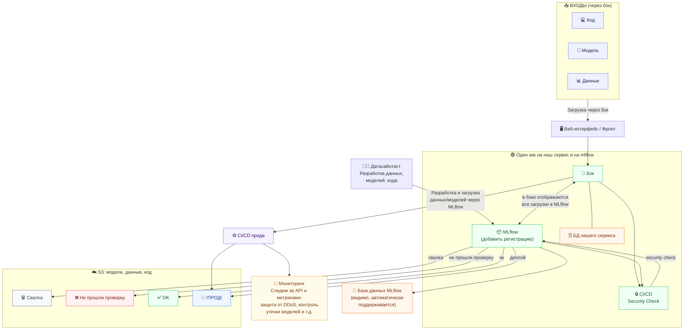

# Архитектура ML-платформы

## Описание системы

Платформа обеспечивает полный цикл разработки и деплоя ML-моделей: от загрузки данных и кода датасайнтистами — через версионирование в MLflow — до автоматизированного CI/CD пайплайна с security-проверками и деплоем на прод.

---

## Граф архитектуры



---

## Компоненты системы

### Входные артефакты

| Компонент | Описание |
|-----------|----------|
| **Код** | Исходный код моделей и пайплайнов |
| **Модель** | Обученные ML-модели |
| **Данные** | Датасеты для обучения и валидации |

### Основные сервисы

| Компонент | Описание |
|-----------|----------|
| **Веб-интерфейс / Фронт** | UI для работы с платформой; принимает входные артефакты |
| **Бэк** | Центральный сервис; отображает все загрузки из MLflow, связан с БД сервиса |
| **MLflow** | Трекинг экспериментов и версионирование моделей/данных; требует добавления регистрации |
| **БД нашего сервиса** | Оперативная база данных бэкенда |
| **База данных MLflow** | Метаданные MLflow (поддерживается автоматически) |

> ⚠️ **Единый аккаунт**: бэк и MLflow работают под одним аккаунтом — это упрощает интеграцию, но требует учёта при разграничении прав доступа.

### Безопасность и CI/CD

| Компонент | Описание |
|-----------|----------|
| **CI/CD Security Check** | Проверка безопасности артефактов перед продвижением |
| **CI/CD прода** | Пайплайн деплоя на продакшн |
| **Мониторинг** | Защита от DDoS, контроль за API и метриками, предотвращение кражи моделей |

### Хранилище S3 (модели, данные, код)

| Бакет | Цвет | Описание |
|-------|------|----------|
| **Свалка** | ⬜ серый | Сырые/необработанные загрузки |
| **Не прошли проверку** | 🔴 красный | Артефакты, отклонённые security check |
| **OK** | 🟢 зелёный | Проверенные артефакты, готовые к использованию |
| **!ПРОД!** | 🔵 синий | Задеплоенные артефакты на продакшне |

---

## Потоки данных

### Поток загрузки артефактов
```
Датасайнтист → MLflow → Бэк (отображение) → S3 (Свалка / Не прошли / OK / ПРОД)
```

### Поток CI/CD
```
Бэк → CI/CD Security Check ↔ MLflow → CI/CD прода → S3 (!ПРОД!) + Мониторинг
```

### Поток пользователя
```
Входы (Код/Модель/Данные) → Веб-интерфейс → Бэк → MLflow
```

---

## Заметки для агентов

- `mlflow` — единая точка версионирования; **регистрация ещё не добавлена** (TODO)
- Бэк и MLflow используют **один аккаунт** — учитывать при настройке IAM/RBAC
- S3 разделён на 4 логические зоны по статусу проверки
- Мониторинг охватывает **API + метрики + защиту модели**
- CI/CD прода triggered из бэка, итоговый артефакт попадает в `S3:!ПРОД!`
